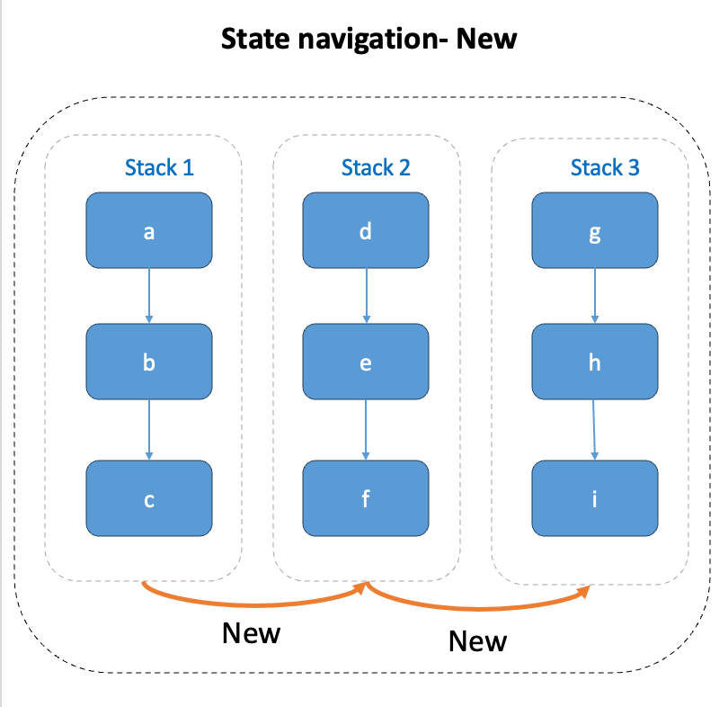
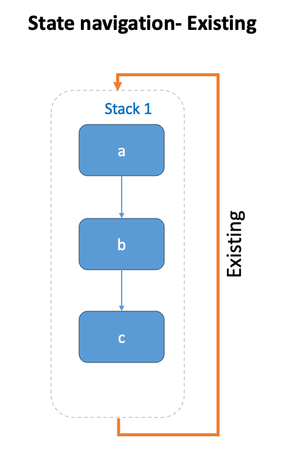

# Navigation

Navigation allows you to flow through the app. Whenever you [go-to](https://docs.jigx.com/examples/readme/actions/go-to) a jig, the jig is added to the history, this allows you to go back and visit the jigs you visited before, and either show the history (data) on the UI or a new (clear) jig. This is helpful in complex flows, for example, adding multiple lines to an invoice and then submitting the invoice, or adding the details for each guest in a booking.

The [go-to](https://docs.jigx.com/examples/readme/actions/go-to) action is used to configure the flow of jigs in the app using the `behaviour` property. With the `behaviour` you determine if you want to push the screen into the app history, by using the `new` value, or show the one you already have in history by using the `existing` value.

**New** - creates a sequential stack showing the progression of navigation. Presents a new screen you are navigating to, allowing you to capture the next data set to add to the stack currently in the history. Typically, this would be used to capture the next line in an invoice. \


<figure><figcaption><p>State Navigation- New</p></figcaption></figure>

**Existing** - jumps to previously visited screens by recognizing existing instances. Displays the data of the existing screen you are navigating to, typically used when you want to review the captured lines in an invoice before submitting.&#x20;

<figure><figcaption><p>State Navigation- Existing</p></figcaption></figure>

## How to configure navigation



In the [go-to](https://docs.jigx.com/examples/readme/actions/go-to) action use the `behaviour` property to select `new` or `existing`.&#x20;



Configure the `LinkTo` property with the jig name you want to open next.&#x20;



Configure `inputs` if you are wanting to pass data between jigs.&#x20;



## Considerations:

* By adding an `instanceId` to the `go-to` action, you choose if you want to create a new state or you want to _reuse the existing state_ of a jig. Do not confuse this with the `behaviour` property's functionality.
* If no `inputs` and `instanceId` are specified, the `instanceId` of the jig is set to `no-inputs`.
* If an `instanceId` is specified, but `inputs` are not, then the `instanceId` uses the one specified.
* If an `instanceId` and `inputs` are specified the `instanceId` uses the one specified.
* If no `instanceId` is specified and `inputs` are specified the `instanceId` is hash (uuid) of the `inputs`.

## Example and code snippets

### go-to using new & existing behaviour

In this example, three jigs are configured to create a stack of data for each guest, including their Name, Age, and Address. Each jig's `go-to` action is set with the `behaviour` property as `new`, enabling new guest details to be pushed into the app history. In the final jig, a secondary `go-to` action is added. This action introduces a button to review each guest's data by setting the `behaviour` property to `existing` and linking to the first jig in the stack via the `linkTo` property. The review process will cycle through each guest's details in the stack before completing.



<figure><figcaption><p>Go-to new guest</p></figcaption></figure>



<figure><figcaption><p>Review guests</p></figcaption></figure>





```yaml
title: Name
type: jig.default

onFocus:
  type: action.reset-state
  options:
    state: =@ctx.solution.state

header:
  type: component.jig-header
  options:
    height: medium
    children:
      type: component.image
      options:
        source:
          uri: https://images.unsplash.com/photo-1521336575822-6da63fb45455?w=800&auto=format&fit=crop&q=60&ixlib=rb-4.0.3&ixid=M3wxMjA3fDB8MHxzZWFyY2h8MTB8fGFkdmVudHVyZXxlbnwwfHwwfHx8MA%3D%3D

children:
  - type: component.form
    instanceId: form-a
    options:
      isDiscardChangesAlertEnabled: false
      children:
        - type: component.text-field
          instanceId: fullName
          options:
            label: Name

actions:
  - children:
      - type: action.action-list
        options:
          title: NEXT
          isSequential: true
          actions:
            - type: action.execute-entity
              options:
                provider: DATA_PROVIDER_LOCAL
                entity: guests
                method: save
                data:
                  fullName: =@ctx.components.fullName.state.value
            # The go-to action is configured to open the next jig in the stack.
            - type: action.go-to
              options:
                # Set the parameters to use the value held in the state,
                # this will be used as an input throughout the stack.
                inputs:
                  fullName: =@ctx.components.fullName.state.value
                # Select new to push the jig into the app history,
                # this allows you to capture the next jig's data in the stack.
                behaviour: new
                # Configure which jig must open next.
                linkTo: jig-b
```



```yaml
title: Age
type: jig.default

# Use inputs from the first jig in the stack.
inputs:
  fullName:
    type: string
    required: true

header:
  type: component.jig-header
  options:
    height: medium
    children:
      type: component.image
      options:
        source:
          uri: https://images.unsplash.com/photo-1471400974796-1c823d00a96f?w=800&auto=format&fit=crop&q=60&ixlib=rb-4.0.3&ixid=M3wxMjA3fDB8MHxzZWFyY2h8M3x8YWR2ZW50dXJlfGVufDB8fDB8fHww

children:
  - type: component.form
    instanceId: form-a
    options:
      isDiscardChangesAlertEnabled: false
      children:
        - type: component.number-field
          instanceId: age
          options:
            label: age
actions:
  - children:
      - type: action.action-list
        options:
          title: NEXT
          isSequential: true
          actions:
            - type: action.execute-entity
              options:
                provider: DATA_PROVIDER_LOCAL
                entity: guests
                method: save
                data:
                  age: =@ctx.components.age.state.value
            # Select new to push the jig into the app history,
            # this allows you to capture the next jig's data in the stack.
            - type: action.go-to
              options:
                # Set the parameters to use the input value passed from the first jig in the stack.
                inputs:
                  fullName: =@ctx.jig.inputs.fullName
                # Select new to push the jig into the app history,
                # this allows you to capture the next jig's data in the stack.
                behaviour: new
                # Configure which jig must open next in the stack.
                linkTo: jig-c
```



```yaml
title: Address
type: jig.default

# Use inputs from the first jig in the stack.
inputs:
  fullName:
    type: string
    required: true

header:
  type: component.jig-header
  options:
    height: medium
    children:
      type: component.image
      options:
        source:
          uri: https://images.unsplash.com/photo-1563013544-824ae1b704d3?w=800&auto=format&fit=crop&q=60&ixlib=rb-4.0.3&ixid=M3wxMjA3fDB8MHxzZWFyY2h8MTB8fG9ubGluZSUyMGNhcnR8ZW58MHx8MHx8fDA%3D

children:
  - type: component.form
    instanceId: form-a
    options:
      isDiscardChangesAlertEnabled: false
      children:
        - type: component.text-field
          instanceId: address
          options:
            isMultiline: true
            label: Address

actions:
  - children:
      - type: action.go-to
        options:
          inputs:
            fullName: =@ctx.jig.inputs.fullName
          # In this go-to action we go back to start capturing the next stack
          # in the data set.
          title: Add another guest
          # Select new to push the jig into the app history,
          # this allows you to capture the next set of data for a new stack.
          behaviour: new
          # Open the first jig in the stack to start capturing the new stack of data.
          linkTo: jig-a
      # Add a second go-to action that will create a secondary button,
      # allowing you to review the existing data set in the stack.
      # Add existing to behaviour which will cycle through all the jigs in the history,
      # showing the jig with the data for each jig.
      # Note the jigs will cycle through the screens for each capture,
      # meaning if you captured 3 sets in the stack, all 3 stacks are shown.
      - type: action.go-to
        options:
          title: Review details
          # Select existing to return and display the jig data
          # that is held in the app history.
          behaviour: existing
          # Open the first jig in the stack to start cycling through the data
          # for each stack captured.
          linkTo: jig-a
```


