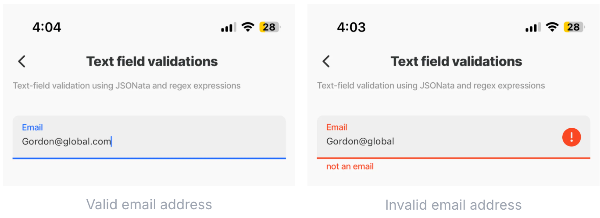

---
layout:
  width: wide
  title:
    visible: true
  description:
    visible: true
  tableOfContents:
    visible: true
  outline:
    visible: true
  pagination:
    visible: true
  metadata:
    visible: true
---

# Validation

Validating fields (text or other) is crucial for ensuring that data entered by users meets specific criteria or formats and for maintaining data integrity and security.

In Jigx Builder you can use regular expressions (regex) for text validation. They allow for pattern matching and can enforce complex rules for text fields such as email addresses, phone numbers, usernames, passwords, and more. When applied to text validation, regex can be used to check if the input text matches the desired format. If it is not valid, an invalid message is displayed.

In Jigx you combine a [JSONata expression](expressions.md) with a [Regex expressions](https://docs.jigx.com/examples/readme/expressions/regex-expressions) to create a validation pattern and provide a message if the pattern does not match.

## Creating the validation expression:

<figure><figcaption></figcaption></figure>

1. JSONata expression - `=@ctx.components.email.state.value`
2. Regex expression - `/^[a-zA-Z0-9._%+-]+@[a-zA-Z0-9.-]+\.[a-zA-Z]{2,}$/`
3. Validation message - `not an email`

Combine the three above to validate an email address in the `text-field` component.


```yaml
- type: component.text-field
          instanceId: email
          options:
            label: Email
            errorText: =$contains(@ctx.components.email.state.value, /^[a-zA-Z0-9._%+-]+@[a-zA-Z0-9.-]+\.[a-zA-Z]{2,}$/) ? '' :'not an email'

```


## Regex and JSONata Expression examples

Here are some common validation expressions to create and use for text field validation.

<table><thead><tr><th width="252.98046875">Validation</th><th>Expected result</th></tr></thead><tbody><tr><td><a href="https://docs.jigx.com/examples/readme/expressions/regex-expressions#phone-number-validation">Phone number</a></td><td>+271234556789</td></tr><tr><td><a href="https://docs.jigx.com/examples/readme/expressions/regex-expressions#email-validation">Email</a></td><td><a href="mailto:name@example.com">name@example.com</a></td></tr><tr><td><a href="https://docs.jigx.com/examples/examples/readme/expressions/regex-expressions#credit-card-validation">Credit Card</a></td><td>Typically 13-16 digits, with spaces or dashes optional, and includes checks for Visa, MasterCard, American Express, and Discover. 1111-1111-1111-1111 or 1111 1111 1111 1111</td></tr><tr><td><a href="https://docs.jigx.com/examples/examples/readme/expressions/regex-expressions#zip-postal-code-us-validation">ZIP/Postal code (US)</a></td><td>5-digit codes, e.g. 10036</td></tr><tr><td><a href="https://docs.jigx.com/examples/readme/expressions/regex-expressions#social-security-number-us-validation">Social Security Number (US)</a></td><td>XXX-XX-XXXX</td></tr><tr><td><a href="https://docs.jigx.com/examples/readme/expressions/regex-expressions#national-insurance-number-uk-validation">National Insurance (UK)</a></td><td>AA123456C</td></tr><tr><td><a href="https://docs.jigx.com/examples/readme/expressions/regex-expressions#us-date-dd-mm-yyyy-validation">US Date (DD/MM/YYYY)</a></td><td>23/07/2024</td></tr><tr><td><a href="https://docs.jigx.com/examples/readme/expressions/regex-expressions#date-mm-dd-yyyy-validation">Date (MM/DD/YYYY)</a></td><td>03/28/2023</td></tr><tr><td><a href="https://docs.jigx.com/examples/readme/expressions/regex-expressions#date-dd-month-yyyy-validation">Date (DD Month YYYY)</a></td><td>25 July 2024</td></tr><tr><td><a href="https://docs.jigx.com/examples/readme/expressions/regex-expressions#date-yyyy-mm-dd-validation">Date (yyyy/mm/dd)</a></td><td>2024/08/30</td></tr><tr><td><a href="https://docs.jigx.com/examples/readme/expressions/regex-expressions#decimal-validation">Decimal</a></td><td>111,25</td></tr><tr><td><a href="https://docs.jigx.com/examples/readme/expressions/regex-expressions#time-h-mm-am-pm-validation">Time (H:MM AM/PM)</a></td><td>12:15 AM or 08:45 PM</td></tr><tr><td><a href="https://docs.jigx.com/examples/readme/expressions/regex-expressions#time-mm-ss-or-hh-mm-validation">Date (MM:SS or HH:MM)</a></td><td>08:10</td></tr><tr><td><a href="https://docs.jigx.com/examples/readme/expressions/regex-expressions#time-in-24-hour-format">Time in 24-hour format</a></td><td>01:00</td></tr><tr><td><a href="https://docs.jigx.com/examples/readme/expressions/regex-expressions#url-validation">URL</a></td><td>example.com or <a href="https://example.com">https://example.com</a></td></tr><tr><td><a href="https://docs.jigx.com/examples/readme/expressions/regex-expressions#isbn-validation">ISBN</a></td><td>978-1-4302-1998-9</td></tr><tr><td><a href="https://docs.jigx.com/examples/readme/expressions/regex-expressions#strict-alpha-numeric-validation">Strict alpha numeric</a></td><td>JohnSmith</td></tr><tr><td><a href="https://docs.jigx.com/examples/readme/expressions/regex-expressions#alpha-numeric-with-spaces-allowed-validation">Alpha numeric with spaces</a></td><td>John Smith</td></tr><tr><td><a href="https://docs.jigx.com/examples/readme/expressions/regex-expressions#validation-of-numbers-and-spaces-only">Numbers and spaces only</a></td><td>56575 76 6</td></tr></tbody></table>

## See Also

* [Regex expressions](https://docs.jigx.com/examples/readme/expressions/regex-expressions)
* [Expressions](expressions.md)
* [Expressions - cheatsheet](expressions-cheatsheet.md)
* [Expression-examples](https://docs.jigx.com/examples/readme/expressions)
