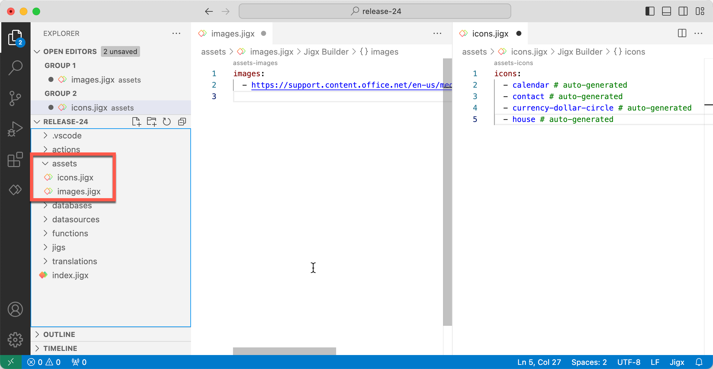

# Assets

The assets, which consist of icons and images, preload and cache when the solution downloads or updates. This allows the images and icons to display when the app is offline and improves the app's performance.

* Jigx Builder loads with an assets folder already created for you.
* When you add icons to any jig files, Jigx Builder automatically creates an icons.jigx file under the assets folder and lists all the icons in the file.
* For images referenced in jig files, Jigx Builder automatically creates an image.jigx file under the assets folder, and the image `headers` are automatically added to this file.

<figure><figcaption><p>Assets folder</p></figcaption></figure>

### Icon assets in solutions

All icons used throughout a solution are automatically added to the **icons.jigx** file under the assets folder.

The following applies to the `icons:` list:

* Each icon change detection automatically causes an update of the `icons:` list in the icons.jigx file.
* All icons from jig files are added to the list, except icons referenced or listed within a datasource or an icon that contains an expression e.g. `icon: ='icon' & '1'`. You can manually add these icons to the list in the icons.jigx file.
* Icons are automatically added to the list or you can manually add icons to the list.
  * Automatically generated icons are indicated by a comment `# auto-generated` after the icon name in the list.
  * Manually added icons do not have the comment added.


```yaml
icons:
  - baseball-bat-ball
  - basketball-hoop
  - contact # auto-generated
  - fitness-weights # auto-generated
  - form # auto-generated
  - people-man-1 # auto-generated
  - swimming-diving # auto-generated
  - tennis-backhand # auto-generated
```


### Image assets in solutions

All images used in the `header` code snippets of a solution are automatically added to the **images.jigx** file under the assets folder. You can manually add any other images referenced throughout the solution to the images.jigx file.

* Automatically generated `header` images are indicated by a comment `# auto-generated` after the image name in the list.
* Manually added images do not have the comment added.

Every item listed in the images.jigx file needs to start with one of the following:

* http:
* https:
* ftp:
* file:
* content:
* res:
* android.resources:
* data:image/png;base64
* data:image/jpeg;base64


```yaml
# Assets that are cached on solution load and will be available offline.
# Array of image URLs you want to cache for offline use.
# This field is auto populated with header images we detect in the solution.
# You can add additional images here if any are missing.

images:
  - https://images.unsplash.com/photo-1440778303588-435521a205bc?ixlib=rb-
  - https://images.unsplash.com/photo-1482449609509-eae2a7ea42b7
  - https://builder.jigx.com/assets/images/header.jpg # auto-generated
  - https://cdn2.webdamdb.com/v1_1280_6enPaxIBt9M3.jpg?1554490336 # auto-generated
  - >- # auto-generated
    https://cdnsm5-ss13.sharpschool.com/UserFiles/Servers/Server_181580/Image/calendar.jpg
```

