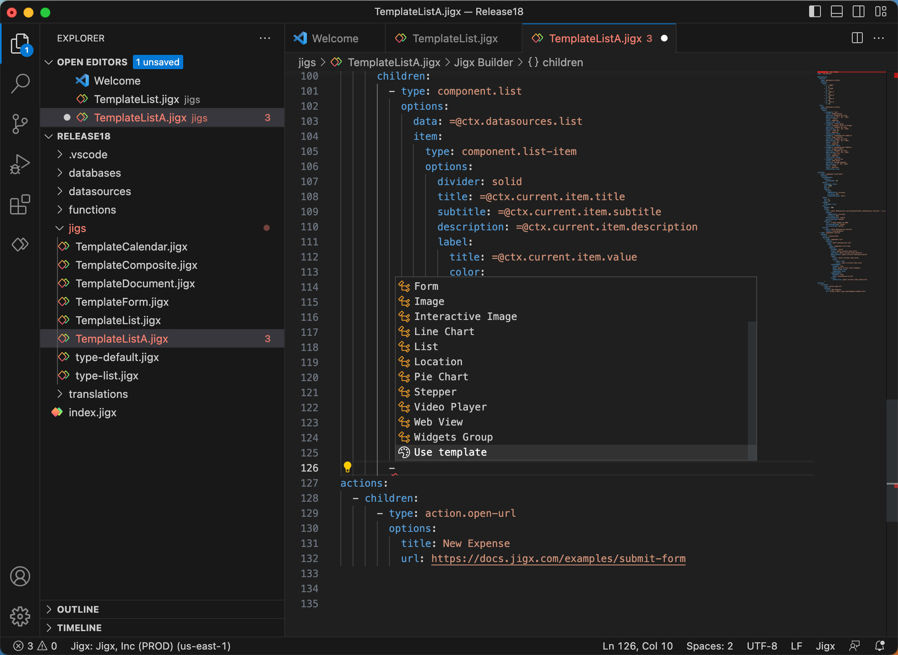

# Component Templates



### Adding component templates

Many components have a set of templates to choose from. Follow the steps below to select a template.

1. Open the **jig** file where you want to add a component. Components normally are added under a `children` node in the YAML. Locate the correct node position in the YAML editor and press the **ctrl+space** keys. The Jigx IntelliSense popup listing the available components opens.

<figure><figcaption>
Component template option
</figcaption></figure>

1. Scroll to the bottom and select **Use template**. The templates gallery opens providing the templates for various components. Use the `Search` and `category` fields to find the template you want to use or browse the gallery by scrolling through the options.
2. Once you have chosen a template, hover over the template and click the blue **insert** button.
3. The selected template YAML will be inserted into your jig file.
4. Add any customization to the code if required.
5. Ensure your jig is referenced to the **index.jigx** file.
6. Publish your solution and view the jig in the app.

#### See Also

* [Jig Templates](../jigs-_screens_/jig-templates.md)
