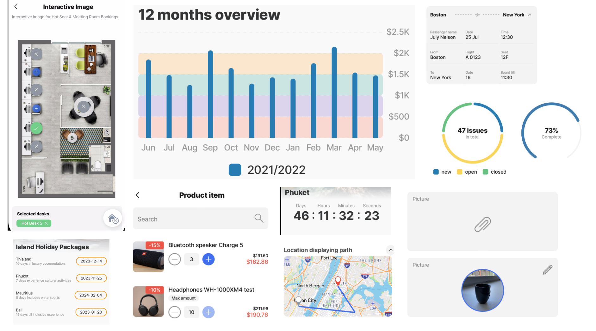
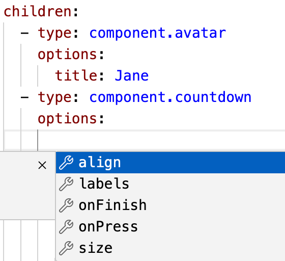
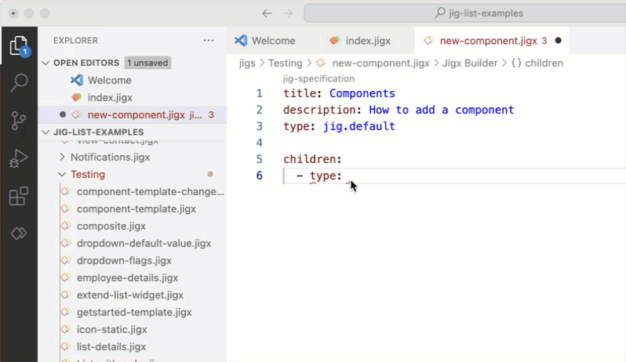

# Components (controls)

Jigx comprises of UI elements known as components, which are an essential part of the app. These components can be in the form of images, avatars, forms, lists, progress bars, charts, and more. They are modular, customizable, and reusable, which ensures consistency and ease of use across the app. These components have predefined behaviors but can be customized to suit your specific requirements. Utilizing these components allows you to create visually appealing and interactive screens that enhance the overall user experience.

<figure><figcaption><p>Components</p></figcaption></figure>

## Considerations

* [Planning](../../../getting-started/planning-your-app/planning-your-app.md) the design of each app screen helps decide which component is best suited to achieve the desired functionality.
* Components can be shown in the [Content widget components](https://docs.jigx.com/examples/widgets), for example, a pie chart or image displays in the widget either on the Home Hub or on a jig.
* Certain components can only be used in specific [jig types](../jigs-_screens_/jigs-_screens_.md), for example, [event](https://docs.jigx.com/examples/event) can only be used with [jig.calendar](https://docs.jigx.com/examples/jigcalendar). Use IntelliSense (_ctrl+space_) in each jig type to see a list of available components for that jig or reference the table below.

## List of components

<table><thead><tr><th width="150.9140625">Type</th><th>Component</th><th>Jig Type</th></tr></thead><tbody><tr><td>Content containers</td><td><a href="https://docs.jigx.com/examples/card">card</a></td><td>default</td></tr><tr><td></td><td><a href="https://docs.jigx.com/examples/readme/components/carousel">carousel</a></td><td>default</td></tr><tr><td></td><td><a href="https://docs.jigx.com/examples/expander">expander</a></td><td>default list</td></tr><tr><td></td><td><a href="https://docs.jigx.com/examples/Tu7v-image">image</a></td><td>default</td></tr><tr><td></td><td><a href="https://docs.jigx.com/examples/jig-header">jig-header</a></td><td>default calendar list document composite</td></tr><tr><td></td><td><a href="https://docs.jigx.com/examples/readme/components/list">list</a> <a href="https://docs.jigx.com/examples/list-item">list-item</a> <a href="https://docs.jigx.com/examples/product-item">product-item</a> <a href="https://docs.jigx.com/examples/t53f-stage">stage</a></td><td>list default</td></tr><tr><td></td><td><a href="https://docs.jigx.com/examples/foRN-location">location</a></td><td>default full-screen</td></tr><tr><td></td><td><a href="https://docs.jigx.com/examples/segmented-control">segmented-control</a></td><td>default</td></tr><tr><td></td><td><a href="https://docs.jigx.com/examples/stepper">stepper</a></td><td>default</td></tr><tr><td></td><td><a href="https://docs.jigx.com/examples/q0Pj-web-view">web-view</a></td><td>default</td></tr><tr><td></td><td><a href="https://docs.jigx.com/examples/readme/components/video-player">video-player</a></td><td>default</td></tr><tr><td>Display</td><td><a href="https://docs.jigx.com/examples/divider">divider</a> <a href="https://docs.jigx.com/examples/entity">entity</a> <a href="https://docs.jigx.com/examples/field-row">field-row</a> <a href="https://docs.jigx.com/examples/entity-field">entity-field</a> <a href="https://docs.jigx.com/examples/section">section</a></td><td>default</td></tr><tr><td>Informational</td><td><a href="https://docs.jigx.com/examples/readme/components/avatar">avatar</a></td><td>default</td></tr><tr><td></td><td><a href="https://docs.jigx.com/examples/bar-chart">bar-chart</a></td><td>default list</td></tr><tr><td></td><td><a href="https://docs.jigx.com/examples/countdown">countdown</a></td><td>default</td></tr><tr><td></td><td><a href="https://docs.jigx.com/examples/count-up">count-up</a></td><td>default</td></tr><tr><td></td><td><a href="https://docs.jigx.com/examples/event">event</a></td><td>calendar</td></tr><tr><td></td><td><a href="https://docs.jigx.com/examples/line-chart">line-chart</a></td><td>default</td></tr><tr><td></td><td><a href="https://docs.jigx.com/examples/pie-chart">pie-chart</a></td><td>default list</td></tr><tr><td></td><td><a href="https://docs.jigx.com/examples/progress-bar">progress-bar</a></td><td>default</td></tr><tr><td></td><td><a href="https://docs.jigx.com/examples/summary">summary</a></td><td>default list document</td></tr><tr><td>Input controls</td><td><p><a href="https://docs.jigx.com/examples/chat">chat</a></p><p><a href="https://docs.jigx.com/examples/choice-field">choice-field</a></p><p><a href="https://docs.jigx.com/examples/duration-picker">duration-picker</a></p><p><a href="https://docs.jigx.com/examples/readme/components/form">form</a> <a href="https://docs.jigx.com/examples/readme/components/media-field">media-field</a></p><p><a href="https://docs.jigx.com/examples/readme/components/text-field">text-field</a></p><p><a href="https://docs.jigx.com/examples/email-field">email-field</a></p><p><a href="https://docs.jigx.com/examples/readme/components/number-field">number-field</a></p><p><a href="https://docs.jigx.com/examples/dropdown">dropdown</a></p><p><a href="https://docs.jigx.com/examples/checkbox">checkbox</a></p><p><a href="https://docs.jigx.com/examples/readme/components/date-picker">date-picker</a></p><p><a href="https://docs.jigx.com/examples/signature-field">signature-field</a></p></td><td>default</td></tr><tr><td>Interactive</td><td><p><a href="https://docs.jigx.com/examples/interactive-image">interactive-image</a></p><p><a href="https://docs.jigx.com/examples/interactive-image-item">interactive-image-item</a></p></td><td>default</td></tr><tr><td>Navigation</td><td><a href="https://docs.jigx.com/examples/widgets">widgets</a></td><td>default composite list document</td></tr></tbody></table>

## YAML structure for components

In Jigx Builder the YAML format for a component is `type: component.avatar` and is configured at a specific level, and under a property depending on the jig type.

* In **default jigs** components are configured under the `children:` property.
* In **full-screen jigs** components are configured under the `component:` property.
* In **list** and **calendar jigs** components are configured under the `item:` property.



```yaml
title: Name
description: Description of your Jig
type: jig.default

children:
  - type: component.avatar
    options:
      title: Jane
```



```yaml
title: Name
type: jig.full-screen

component:
  type: component.chat
  instanceId: myChat
```



```yaml
title: Name
description: Description of your Jig
type: jig.list
icon: contact

data: =@ctx.datasources.mydata
item:
  type: component.list-item
  options:
    title: =@ctx.current.item.datasourcefield
    subtitle: =@ctx.current.item.datasourcefield
```



Multiple components can be added in certain jig types such as the default jig which is the most versitle. The components are configured at the same level as the first component; or are nested under other components but will be preceeded by a `children:` property.


```yaml
title: Multiple components
type: jig.default

children:
  # First component
  - type: component.avatar
    options:
      title: Jane
  # Add second component at the same YAML level as the first
  - type: component.countdown
    options:
      expiresAt: "2024-08-13"
  # Add second component at the same YAML level as the first
  - type: component.section
    options:
      title: Register
      # Add a nested component under a new children property
      children:
        - type: component.form
          instanceId: RegistrationForm
          options:
            # Add a nested component under a new children property
            children:
              - type: component.text-field
                instanceId: name
                options:
                  label: First and last name
```




Each components YAML loads with the core required properties. Use IntelliSense under each components `options:` property to discover additional optional properties. These properties usually help with **styling**, **postioning** and **size**.



<figure><figcaption><p>Optional properties</p></figcaption></figure>



## How to add a UI component

<figure><figcaption><p>Adding components</p></figcaption></figure>

1. Open or create a solution in Jigx Builder.
2. Open the jig type where the component must be configured. The default YAML structure of the jig prepopulates.
3. Under the correct YAML level (either under `children`, `item`, `component` depending on the jig type), _ctrl+space_ to invoke Intellisense for the list of available components.
4. Select the required component, the core properties will load in the code snippet. Configure the properties accordingly using expressions and values.
5. Use IntelliSense under each components `options:` property to discover additional optional properties, relating to styling, positioning or size.

## Adding data to components

Creating dynamic, interactive, and user-centric jigs require components to be functional, and relevant to the user. To achieve this use [data](../../data/data.md) when configuring components, and expose the specific data in the compoment by configuring [expressions](../../logic/expressions.md), such as: `type: component.countdown` `options:` `expiresAt: =@ctx.datasources.event-dd[2].StartDate`

Certain components make it easy to add data through a `data:` property set at the start of the component allowing the data fields to be easily referenced in expressions. For example:

```yaml
# reference a datasource for context throughout the component
data: =@ctx.datasources.users
item:
  type: component.list-item
  options:
    divider: solid
    # Use the data reference to configure properties in the component
    title: =@ctx.current.item.title
    subtitle: =@ctx.current.item.subtitle
    description: =@ctx.current.item.description
    color:
      - when: =@ctx.datasources.users.color
        color: =@ctx.current.item.color
```

## Adding actions to components - (single or multiple)

Engaging users on every screen of your app is vital to its success. By adding actions to your components you add an interactive element that keeps the user engaged. For example, in a list component you can press on an item in the list, or swipe left or right to delete/update or go to another jig. Actions that can be added to components are configured as part of the component YAML and are available by invoking intellisense. Here is a list of actions to use with components:

* `onChange`
* `onDelete`
* `onSuccess`
* `onPress`
* `onFinish`
* `swipeable`


```yaml
item:
  type: component.list-item
  options:
    title: =@ctx.current.item.companyName
    subtitle: =@ctx.current.item.firstName & ' ' & @ctx.current.item.lastName
    description: =@ctx.current.item.jobTitle
    # The list-item action that defines what to do when swiping left or right 
    # on the item.
    leftElement:
      element: avatar
      text: =$substring(@ctx.current.item.firstName, 0, 1) & $substring(@ctx.current.item.lastName, 0, 1)
      type: action.go-to
      options:
        linkTo: view-contact
        parameters:
          contact: =@ctx.current.item
    # The list-item action that defines what to do when swiping left on the 
    # item.
    swipeable:
      left:
        # Add first icon with action when swiping left to delete the list-item
        - label: DELETE
          icon: delete-2
          color: negative
          # The action that defines what to do when pressing on the delete icon
          # after swiping left.
          onPress:
            type: action.execute-entity
            options:
              provider: DATA_PROVIDER_DYNAMIC
              entity: default/contacts
              method: delete
              data:
                id: =@ctx.current.item.id
        # Add a second icon with action when swiping left to edit the list-item
        - label: EDIT
          icon: edit-pdf
          color: primary
          # The action that defines what to do when pressing on the edit icon 
          # after swiping left.
          onPress:
            type: action.go-to
            options:
              linkTo: edit-contact
              parameters:
                contact: =@ctx.current.item
```


## Component properties used for layout (columns, rows, and sections)

<table><thead><tr><th width="184.5703125">Component/Property</th><th>Description</th></tr></thead><tbody><tr><td>entity > section</td><td>Create relevant display <a href="https://docs.jigx.com/examples/section">sections</a> for the information to be functional yet elegant and neatly organized.</td></tr><tr><td>enitiy > entity-field</td><td><a href="https://docs.jigx.com/examples/entity-field">Entity-fields</a> are used for display purposes only, such as displaying text, numbers, dates, and currency from a datasource. Entity-fields are available in default jigs and can be nested under field-row and/or section components if required.</td></tr><tr><td>entity > field-row</td><td>The <a href="https://docs.jigx.com/examples/field-row">field-row</a> component contains other components and displays them on the same row. This component ensures that items are placed next to each other instead of underneath each other. By default all components are automatically placed in a new row.</td></tr><tr><td>leftElement</td><td>The <code>leftElement</code> property is used to place visual elements on the left-hand side in a component, such as an icon, image, text or button.</td></tr><tr><td>rightElement</td><td>The <code>rightElement</code> property is used to place visual elements on the right-hand side in a component, such as an icon, image, text or button.</td></tr><tr><td>leftIcon</td><td>The <code>leftIcon</code> property is used to place an icon on the left-hand side of a component.</td></tr><tr><td>rightIcon</td><td>The <code>rightIcon</code> property is used to place an icon on the right-hand side of a component.</td></tr></tbody></table>

## Component templates

See [Component Templates](component-templates.md) for steps on how to add components from a preconfigured set of templates.

## Examples and code snippets

In the example tab, you can see code examples for each [component](https://docs.jigx.com/examples/components).
