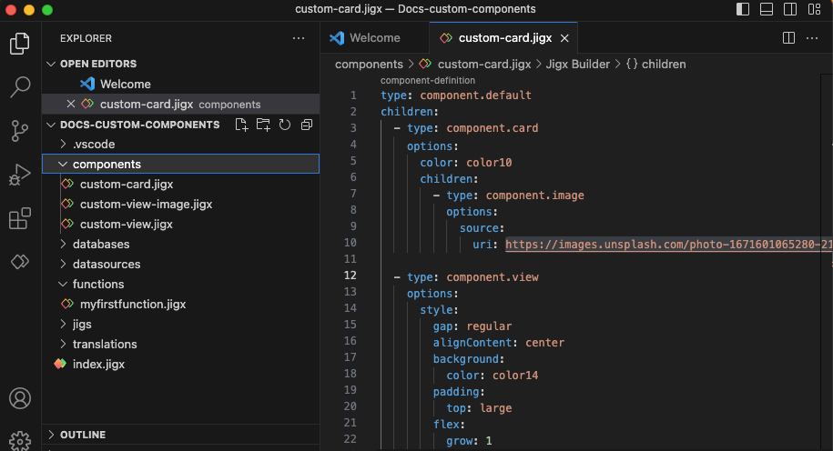
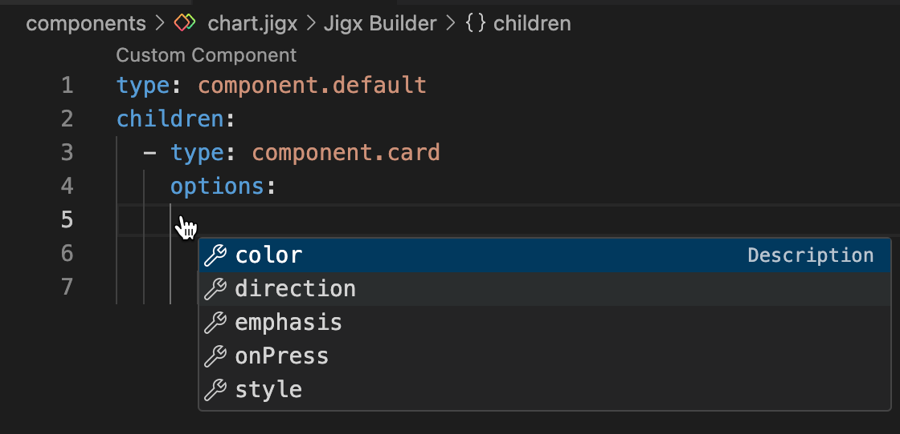
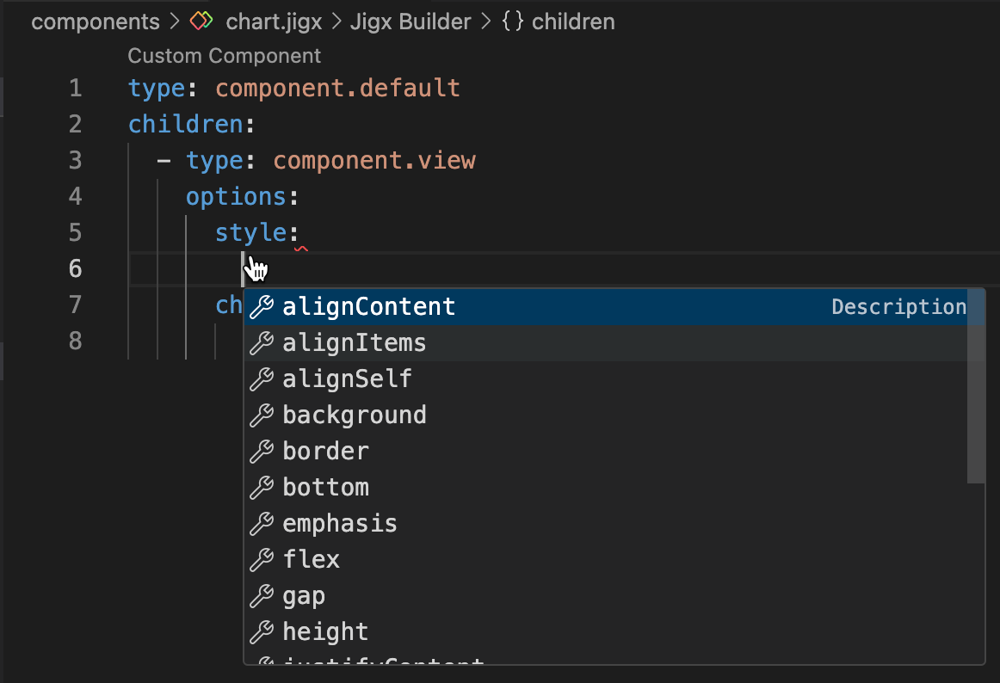

# Creating custom components (Alpha)


This feature is currently in its **Alpha** stage of development.

* As an early version, it may not include all planned functionalities and is subject to significant changes based on ongoing development and user feedback.
* In this phase, the feature may contain bugs or behave unpredictably.
* Jigx recommends using standard, fully supported components until this feature has been fully tested and refined.
* We encourage you to provide feedback and report any issues to help us improve and refine the feature for future releases.&#x20;


## File Location

In a Jigx project all custom components are created in the **components** folder with the .jigx extension, for example, custom-card.jigx. You can create subfolders inside the component folder if required. Ensure you use a unique naming convention for each file in each folder. If files have the same name Jigx Builder uses the first file found in the components folder with that name and shows it in the IntelliSense code snippet in a jig file. If you have a components folder under jigs or elsewhere in your project, Jigx Builder sees it as components and validates the jigs against the rules of components.

<figure><figcaption><p>Component folder</p></figcaption></figure>

## File structure

All custom component files start with:

`type: component.default` `children:`

Under `children:` you add the components you want to customize. Invoke **IntelliSense** to see the list of available components.

Between `options:` and `children:` you can add predefined styling elements depending on the component selected. The components that allow customization are [Card (Alpha)](https://docs.jigx.com/examples/card-alpha), [View (Alpha)](https://docs.jigx.com/examples/view-alpha), [Text (Alpha)](https://docs.jigx.com/examples/text-alpha), [Icon (Alpha)](https://docs.jigx.com/examples/icon-alpha), and [Button (Alpha)](https://docs.jigx.com/examples/button-alpha). Use **IntelliSense** to view the available list.

<figure><figcaption><p>Card Styling options</p></figcaption></figure>

For `component.view` the `options:` followed by `style:` are required before `children:`. All available styling elements are listed under the `style:` property using **IntelliSense**.

<figure><figcaption><p>View styling options</p></figcaption></figure>

## Using custom component files in jigs

You can use the custom component files in multiple jig files by referencing `component.custom-component` and using the `componentId:` property to reference the name of the custom component file. Adding an `instanceId` allows the same custom component to be used in different instances and enables the use of [outputs](inputs-_-outputs-_alpha_.md).



```yaml
# jigs/use-custom-component.jigx
title: Card with view
# custom components can only be used in a default jig
type: jig.default

children:
  # to reference custom components use the component.custom-component property
  - type: component.custom-component
    # Reference the name of the custom component file in the componentId property
    componentId: custom-card
    # Give the component an instanceId allowing it to be used in different 
    # instances.
    instanceId: cardId
  # Multiple custom components can be referenced in a single jig
  - type: component.custom-component
    componentId: custom-view
    # Give the component an instanceId allowing it to be used in different 
    # instances.
    instanceId: viewId
```



```yaml
# components/custom-card.jigx
type: component.default
children:
  # Reference the custom component type.
  - type: component.card
    options:
      # Add the styling properties required for the card.
      # Styling properties are optional;
      # you can use one or more as needed, there’s no requirement to use them all.
      direction: column
      emphasis: high
      color: color10
      children:
        # Add other standard or custom components into the card if required.
        - type: component.image
          options:
            source:
              uri: https://images.unsplash.com/photo-1671601065280-215ca5072af9?ixlib=rb-4.0.3&ixid=M3wxMjA3fDB8MHxwaG90by1wYWdlfHx8fGVufDB8fHx8fA%3D%3D&auto=format&fit=crop&w=1364&q=80
```



```yaml
# components/custom-view.jigx
type: component.default
children:
  # Reference the custom component type
  - type: component.view
    options:
      # The style property is required with the view component
      style:
        # Add the styling properties required.
        # Styling properties are optional;
        # you can use one or more as needed, there’s no requirement to use them all.
        gap: regular
        alignContent: center
        background:
          color: color14
        padding:
          top: large
          left: large
          right: large
          bottom: large
        flex:
          grow: 1
          direction: row
        justifyContent: space-between

      children:
        # Add other standard or custom components into the card if required.
        # This example uses custom components
        - type: component.icon
          options:
            icon: earth-3

        - type: component.text
          options:
            value: Fox
            weight: bold
            size: medium

        - type: component.text
          options:
            value: animal
            size: small
            emphasis: medium
```



## Examples and code snippets

In the Reference & Examples tab, you can see code examples for each [custom component](https://docs.jigx.com/examples/custom-components-alpha).
