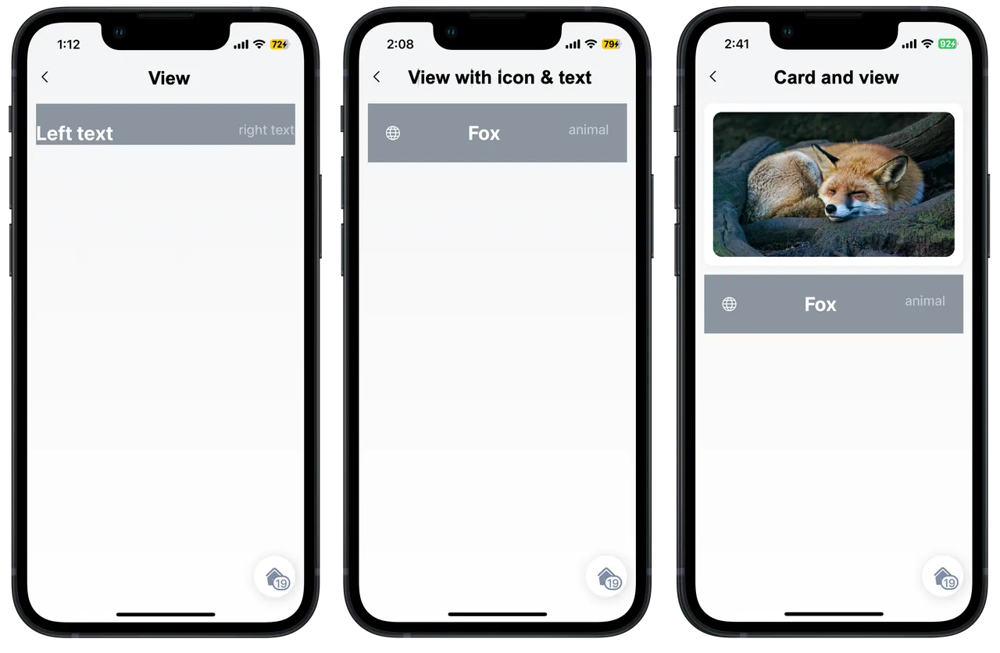

# Custom Components (Alpha)


This feature is currently in its **Alpha** stage of development.

* As an early version, it may not include all planned functionalities and is subject to significant changes based on ongoing development and user feedback.
* In this phase, the feature may contain bugs or behave unpredictably.
* Jigx recommends using standard, fully supported components until this feature has been fully tested and refined.
* We encourage you to provide feedback and report any issues to help us improve and refine the feature for future releases.&#x20;


## What are custom components?

Custom components in Jigx extend the standard set of components, offering enhanced UI capabilities and features that allow you to create tailored solutions to meet your unique requirements and differentiate your apps. These components can improve the visual presentation and interaction within your Jigx App, and include custom elements like cards, views, buttons, icons, and text. Customization is made possible through CSS property options, with predefined code snippets providing limited variations. One significant advantage of creating custom components is their reusability across multiple Jigx files within a project.

<figure><figcaption>
Custom Components
</figcaption></figure>

### Why and when to use custom components

It is important to know when to create custom components versus using the standard components. Here are reasons why and when it makes sense to create custom components:

1. If you cannot achieve the UI design you are looking for using the standard Jigx components, then use custom-components.
2. If you want to use the same component across multiple jigs in your project, you can create a custom component. This makes it reusable and accessible in any jig, saving you time and effort while maintaining consistency.
3. If you want to share the custom component files with another creator for use in a different project by copying and pasting the YAML code. Custom components are designed to ensure a standardized and consistent UI experience on mobile devices.

### Understanding the custom components layout

The `component.card` and `component.view` form the base of custom components by creating the containers in which other components can be added. It is important to understand the layout concepts of each before you create the component.

<figure><figcaption>
Layout
</figcaption></figure>

#### Card

The `component.card` is a wrapper that contains predefined options, such as shadow, corner radius, inner padding, emphasis, color, and direction (that allows for defining rows and columns). We allow you to define the values for the color, and direction properties, the other properties are preset and cannot be changed. Inside the `component.card` you can place other standard components as well as other custom components. The list of properties and examples are available in [Card (Alpha)](https://docs.jigx.com/examples/card-alpha).

<figure><figcaption>
Basic colored card with components
</figcaption></figure>

#### View

The `component.view` is an empty container similar to the \
 element in CSS or HTML. You can style the component using the large list of predefined options based on CSS elements such as color, flex, alignment, weight, size, and many more. The view component is excellent to use for designing layouts. The YAML always has the `style:` property that contains all style elements, such as color, direction for rows and columns, and the `children:` property for adding other components such as avatar, text, and icons. You can also place a `component.card` inside the view. The list of properties and examples are available in [View (Alpha)](https://docs.jigx.com/examples/view-alpha).

<figure><figcaption>
Basic view with components
</figcaption></figure>

#### Other custom components

The other custom components are listed below, with a link to the topic containing each one's properties and examples.

* [Button (Alpha)](https://docs.jigx.com/examples/button-alpha)
* [Icon (Alpha)](https://docs.jigx.com/examples/icon-alpha)
* [Text (Alpha)](https://docs.jigx.com/examples/text-alpha)

### Considerations

* Working with custom components requires existing knowledge of Jigx Builder, how to build a Jigx project, jigs, functions, expressions, actions, and components.
* Custom components are considered advanced capabilities in Jigx and are used mainly for UI improvements.
* Before creating jigs or custom components, design and plan the UI you require by creating wireframes or sketching out the jigs first. Find inspiration from other sources, sites, or apps to base your app design on.
* Create the skeleton of the jig first, then build the custom components and add them into the jig
* The structure of the custom component can affect the app's performance at runtime, such as the amount of data returned. Performance should be a consideration when designing your app.
* Always test the app as elements in the UI can break the design, for example; longer text that causes the text to wrap or get cut off, more data is displayed than expected, or images do not render as expected.
