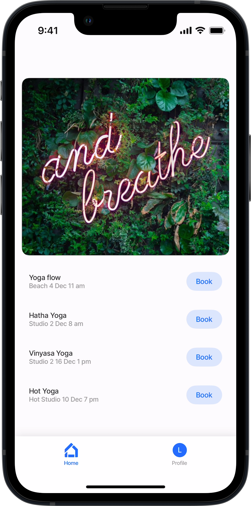
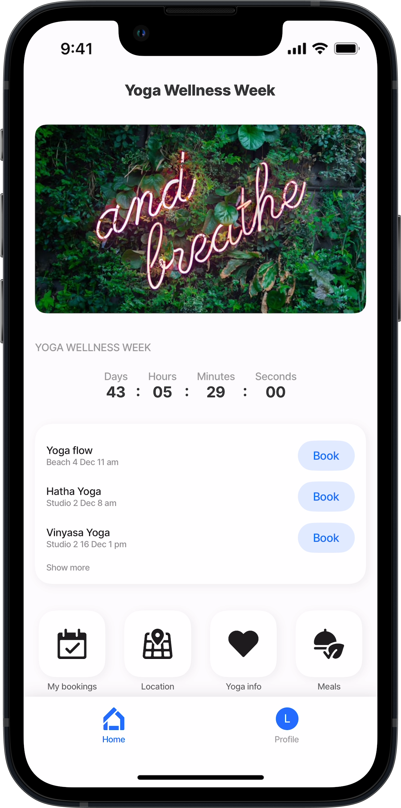
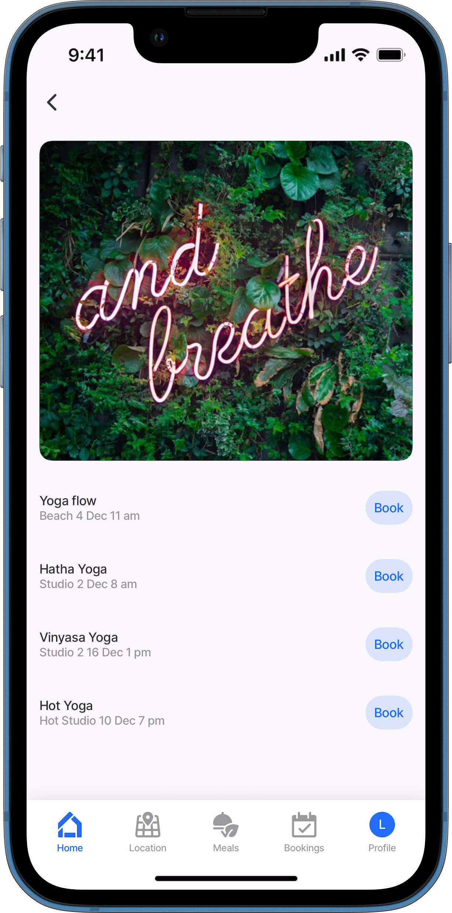

---
layout:
  width: wide
  title:
    visible: true
  description:
    visible: true
  tableOfContents:
    visible: true
  outline:
    visible: true
  pagination:
    visible: true
  metadata:
    visible: true
---

# Creating a Home Hub

Creating a home screen (hub) for a mobile app can be a great way to enhance the user experience and provide more functionality. In this section, we will explore the benefits of creating a home screen and the steps involved in configuring one.

## How to create a Home Hub

Steps to customize your Home Hub:

1. Create and configure a jig with the functionality and style that you require on the Home Hub. The [jig.default](https://docs.jigx.com/examples/jigdefault) or [jig.grid](https://docs.jigx.com/examples/readme/jig-types/jig_grid) are great options to use.
2. Use IntelliSense (ctrl+space) to open the list of available options in the index.jigx file, and select `tabs`.
3. In the `jigId` property, use IntelliSense again to choose the jig you configured as your Home Hub.
4. _Optional_ - Choose an icon that will represent the Home Hub. The selected icon is displayed as the first icon in the navigation bar at the bottom of the app.
5. Add the `onLoad` or `onRefresh` events for syncing data.
6. You can configure additional `tabs` by repeating the steps above.

### Example and code snippet

### Single jig Home Hub



Here is an example of a Home Hub designed for its simplicity. A `jig.default` is used with a `component.image` and `component.list`.



<figure><figcaption><p>Simple List Home Hub</p></figcaption></figure>





```yaml
name: Expo 
title: Expo
category: business

# Data is synced in the index.jigx file.
onLoad: 
  type: action.sync-entities
  options:
    provider: DATA_PROVIDER_DYNAMIC
    entities:
      - default/events

# Use the tabs property to reference the jig you want as the home screen.
# Select an icon for the jig in the bottom navigation bar.
tabs:
  - jigId: yoga-wellness
    icon: home-apps-logo
```



```yaml
# To hide any title use ' ' in the title field
title: ' ' 
type: jig.default

datasources:
  yoga: 
    type: datasource.sqlite
    options:
      provider: DATA_PROVIDER_DYNAMIC

      entities:
        - default/events

      query: 
        SELECT
          id, 
          '$.EventName', 
          '$.StartDate', 
          '$.Time', 
          '$.Venue', 
          '$.Type' 
        FROM [default/events] WHERE '$.Type' = 'Yoga'
       
children: 
  - type: component.image
    options:
      height: 300
      resizeMode: cover
      source:
        uri: https://images.unsplash.com/photo-1524901548305-08eeddc35080?w=700&auto=format&fit=crop&q=60&ixlib=rb-4.0.3&ixid=M3wxMjA3fDB8MHxzZWFyY2h8Nnx8Y2FsbXxlbnwwfHwwfHx8MA%3D%3D
 
  - type: component.list
    options:
      data: =@ctx.datasources.yoga
      item: 
        type: component.list-item
        options:
          title: =@ctx.current.item.EventName
          subtitle: =(@ctx.current.item.Venue & ' ' & @ctx.current.item.StartDate & ' ' & @ctx.current.item.Time)
          rightElement: 
            element: button
            title: Book
            onPress: 
              type: action.go-to
              options:
                linkTo: contacts
```



### Home Hub with multiple components & widgets



<figure><figcaption><p>Custom home hub</p></figcaption></figure>



In this example a jig.default is created with a `component.image` , `component.section`, `component.countdown` and `component.grid`. The grid component references four jigs and shows them as widgets that when tapped opens the jigs





```yaml
title: Yoga Wellness Week
type: jig.default
       
children: 
  - type: component.image
    options:
      height: 200
      resizeMode: cover
      source:
        uri: https://images.unsplash.com/photo-1524901548305-08eeddc35080?w=700&auto=format&fit=crop&q=60&ixlib=rb-4.0.3&ixid=M3wxMjA3fDB8MHxzZWFyY2h8Nnx8Y2FsbXxlbnwwfHwwfHx8MA%3D%3D
 
  - type: component.section
    options:
      title: Yoga Wellness Week
      children:
        - type: component.countdown
          options:
            size: medium
            expiresAt: "2025-01-25T17:30:00+02:00"
    
  - type: component.grid
    options:
      children:
        - type: component.grid-item
          options:
            size: 4x2
            children: 
              type: component.jig-widget
              options:
                jigId: yoga-list
        - type: component.grid-item
          options:
            size: 1x1
            children: 
              type: component.jig-widget
              options:
                jigId: my-bookings
        - type: component.grid-item
          options:
            size: "1x1"
            children: 
              type: component.jig-widget
              options:
                jigId: yoga-location
        - type: component.grid-item
          options:
            size: "1x1"
            children: 
              type: component.jig-widget
              options:
                jigId: yoga-info
        - type: component.grid-item
          options:
            size: "1x1"
            children: 
              type: component.jig-widget
              options:
                jigId: yoga-meals 
```



```yaml
name: Expo 
title: Expo
category: business
    
# Data is synced in the index.jigx file
onLoad: 
  type: action.sync-entities
  options:
    provider: DATA_PROVIDER_DYNAMIC
    entities:
      - default/events
# Configure the tabs in the bottom navigation bar.
# The tab opens on the home screen.       
tabs:
  home:
    jigId: yoga-home
    icon: home-apps-logo      
```



```yaml
datasources:
  yoga: 
    type: datasource.sqlite
    options:
      provider: DATA_PROVIDER_DYNAMIC

      entities:
        - default/events

      query: 
        SELECT
          id, 
          '$.EventName', 
          '$.StartDate', 
          '$.Time', 
          '$.Venue', 
          '$.Type' 
        FROM [default/events] WHERE '$.Type' = 'Yoga'
```



### Home Hub with multiple tabs in bottom navigation bar



In this example, four jigs are created. In the index.jigx file, they are configured in the `tabs` properties, which generates the custom bottom navigation bar.



<figure><figcaption><p>Bottom navigation bar with 4 tabs</p></figcaption></figure>





```yaml
name: Expo 
title: Expo
category: business
    
# Data is synced in the index.jigx file.
onLoad: 
  type: action.sync-entities
  options:
    provider: DATA_PROVIDER_DYNAMIC
    entities:
      - default/events
# Configure the tabs in the bottom navigation bar.
# Select an icon for the jig in the bottom navigation bar.
# The first four tabs display in the bottom navigation bar.
# Additional tabs display when the More (ellipsis) button is tapped.         
tabs:
  Home:
    jigId: yoga-wellness
    icon: home-apps-logo
  Location:
    jigId: yoga-location
    icon: location
  Meals:
    jigId: yoga-meals
    icon: vegan-vegetarian-food-dome
  Bookings:
    jigId: my-bookings
    icon: event        
```



```yaml
# First tab's jig.
title: ' ' # To hide any title use ' '
type: jig.default

datasources:
  yoga: 
    type: datasource.sqlite
    options:
      provider: DATA_PROVIDER_DYNAMIC

      entities:
        - default/events

      query: 
        SELECT
          id, 
          '$.EventName', 
          '$.StartDate', 
          '$.Time', 
          '$.Venue', 
          '$.Type' 
        FROM [default/events] WHERE '$.Type' = 'Yoga'
       
children: 
  - type: component.image
    options:
      height: 300
      resizeMode: cover
      source:
        uri: https://images.unsplash.com/photo-1524901548305-08eeddc35080?w=700&auto=format&fit=crop&q=60&ixlib=rb-4.0.3&ixid=M3wxMjA3fDB8MHxzZWFyY2h8Nnx8Y2FsbXxlbnwwfHwwfHx8MA%3D%3D
 
  - type: component.list
    options:
      data: =@ctx.datasources.yoga
      item: 
        type: component.list-item
        options:
          title: =@ctx.current.item.EventName
          subtitle: =(@ctx.current.item.Venue & ' ' & @ctx.current.item.StartDate & ' ' & @ctx.current.item.Time)
          rightElement: 
            element: button
            title: Book
            onPress: 
              type: action.go-to
              options:
                linkTo: contacts
```



```yaml
# Second tab's jig.
title: Location
type: jig.default
icon: location
  
datasources:
  address: 
    type: datasource.static
    options:
      data:
        - street: 768 5th Ave
          city: New York
          country: US
children:
  - type: component.location 
    options:
      camera:
        centerPosition: middle
        address: =@ctx.datasources.address.street & ',' & @ctx.datasources.address.city & ',' & @ctx.datasources.address.country
        zoomLevel: 9
```



```yaml
# Third tab's jig.
title: Meals
type: jig.default
icon: vegan-vegetarian-food-dome

header:
  type: component.jig-header
  options:
    height: medium
    children:
      type: component.image
      options:
        source:
          uri: https://images.unsplash.com/photo-1664052224705-e272eed9338f?w=800&auto=format&fit=crop&q=60&ixlib=rb-4.0.3&ixid=M3wxMjA3fDB8MHxzZWFyY2h8NHx8eW9nYSUyMG1lYWxzfGVufDB8fDB8fHww
datasources:
  
  meals: 
    type: datasource.static
    options:
      data:
        - id: 1
          option: Morning Ritual (Pre-Yoga)
          meal: Warm Lemon & Ginger Water
          icon: fruit-lemon
        - id: 2
          option: Breakfast (Post-Yoga)
          meal: Ayurvedic Kitchari Bowl
          icon: pasta-bowl-warm
        - id: 3
          option: Lunch (Main Meal of the Day)
          meal: Sattvic Buddha Bowl
          icon: asian-food-noodle-ramen-bowl
        - id: 4
          option: Afternoon Tea (Optional)
          meal: Golden Milk (Turmeric Latte) 
          icon: coffee-cup
        - id: 5
          option: Light Dinner (Pre-Meditation)
          meal: Steamed Vegetables & Avocado Toast  
          icon: fruit-avocado-slice        
          
children:
  - type: component.list
    options:
      data: =@ctx.datasources.meals
      maximumItemsToRender: 8
      item: 
        type: component.list-item
        options:
          title: =@ctx.current.item.option
          description: =@ctx.current.item.meal
          leftElement: 
            element: icon
            icon: =@ctx.current.item.icon
          rightElement: 
            element: checkbox
            value: "true"
```



```yaml
# Fourth tab's jig.
title: My bookings
type: jig.default
icon: event

header:
  type: component.jig-header
  options:
    height: medium
    children: 
      type: component.image
      options:
        source:
          uri: https://images.unsplash.com/photo-1608405059861-b21a68ae76a2?w=800&auto=format&fit=crop&q=60&ixlib=rb-4.0.3&ixid=M3wxMjA3fDB8MHxzZWFyY2h8Mnx8eW9nYSUyMG1lYWxzfGVufDB8fDB8fHww

children:
  - type: component.list-item
    options:
      title: Yoga Flow
      subtitle: 4 Dec 11am
```



## Best practice

* Adding videos directly to the Home Hub should be avoided if possible, instead add a gallery of images that when tapped open a jig with the video, use [grid-item](https://docs.jigx.com/examples/grid-item) to create the gallery.
* Consider what you add to the Home Hub as it could impact the app's performance, for example, long lists with data.
* The `onload` event must be configured on the index.jigx file for syncing data to the device.
* When deciding on the type of jig to use as the Home Hub it is recommended to use the [jig.default](https://docs.jigx.com/examples/jigdefault) or [jig.grid](https://docs.jigx.com/examples/readme/jig-types/jig_grid) as they provide the broadest scope of components, actions, and widgets.
