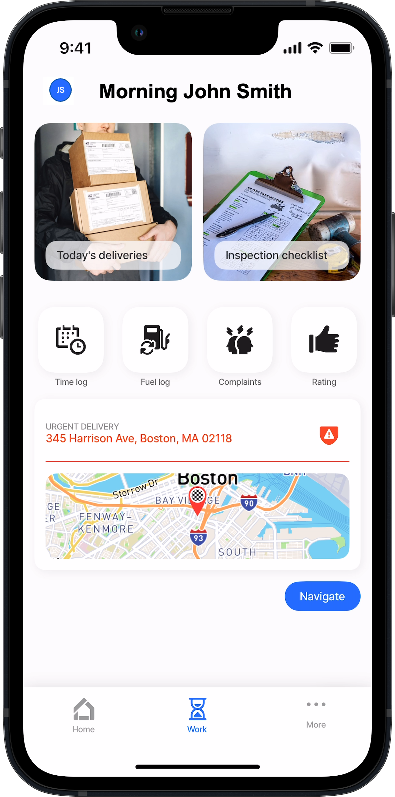

# Home Hub



Having a good home screen is essential for any mobile app as it is the first screen that users see when they open the app. A home screen should provide users with quick access to the most important features of the app, while also being visually appealing and easy to navigate. It should be intuitive and provide users with a clear understanding of what the app does and how to use it. Careful consideration should be given during the [design](../../../getting-started/planning-your-app/home-screen.md) process. In Jigx the home screen is called the Home Hub and is accessed after signing into the app.&#x20;



<figure><figcaption>
Home screen
</figcaption></figure>



Jigx allows you to use various options when personalizing your Home Hub. Any jig can be placed on the home hub, and components accessible in the home hub include:

* [User Profile](https://docs.jigx.com/examples/user-profile)
* [Solution switching](<../../../Understanding the basics/Jigx Concepts.md>)
* Tabs in [Index settings](index-settings.md)
* [grid](https://docs.jigx.com/examples/grid) and [grid-item](https://docs.jigx.com/examples/grid-item)

### tabs

* Create a landing page/ home screen by configuring the navigation tabs that show at the bottom of the app. You can configure multiple tabs. The first four tabs are displayed in the Home Hub bottom navigation. Additional tabs appear when the _More_ (ellipsis) button is tapped.
* Each tab is associated with a jig that is displayed when pressed. The first tab by default displays when the app is opened.
* Setting the [grid](https://docs.jigx.com/examples/grid) jig as the first tab's jig creates a visually appealing and easy-to-navigate home screen.&#x20;

### grid and grid-item

* The [grid](https://docs.jigx.com/examples/grid) and [grid-item](https://docs.jigx.com/examples/grid-item) are available in 5 different `sizes`: 1x1, 2x2, 4x2, 2x4, and 4x4.
* The `jigId` property refers to the name/ unique identifier of the jig we are using.
* There is also an optional property `when` that allows the grid-item to be displayed/hidden in a particular situation based on the expression.
* Within the grid-item you can select to show [widgets](https://docs.jigx.com/examples/oVbi-widgets), an [image](https://docs.jigx.com/examples/Tu7v-image), and [Custom Components (Alpha)](../custom-components-_alpha_/custom-components-_alpha_.md).
* Add an `onPress` event to a grid-item to configure an action such as `open-url` without going to jig.&#x20;

For a code example see [Creating a Home Hub](creating-a-home-hub.md).
