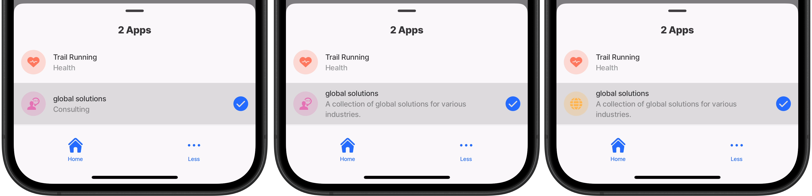
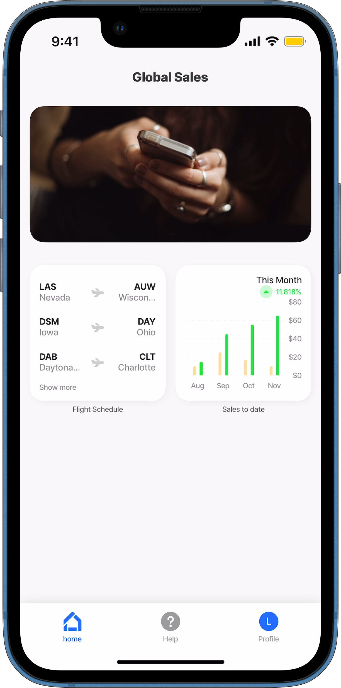
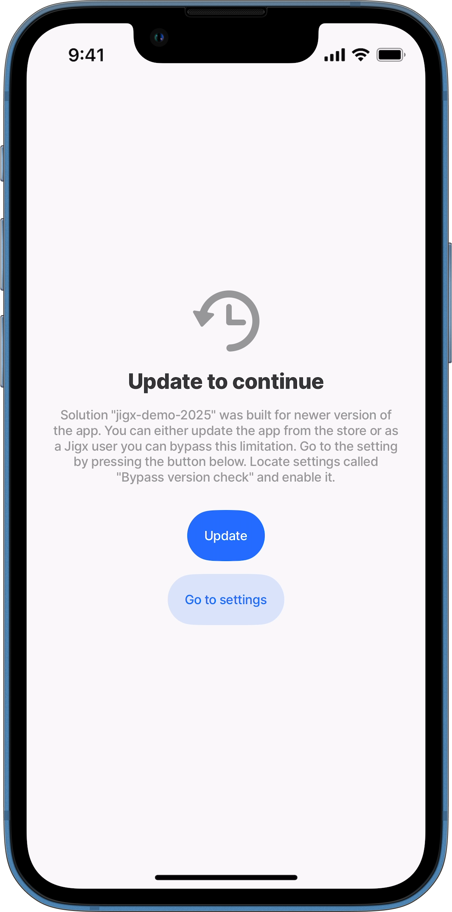

# Index settings

In the `index.jigx` file, you set solution settings, including the primary information about the solution, the [Home Hub](home-hub.md) set up, and properties reusable throughout the solution.

## Name, title, category, description

* **Name** - Your internal solution name.
* **Title** - This name will be displayed in your app and [management](https://manage.jigx.com).
* **Category** - The category can be customized and is overwritten when the description property is added.
* **Description** - A description you provide for your solution. This will replace the selected category.
* **Icon** - Customize the solutions icon. A list of [icons](https://docs.jigx.com/jigx-icons) is available.
* **Color** - Apply a color to the selected icon.

<figure><figcaption><p>Solution details</p></figcaption></figure>



```yaml
name: global-solutions
title: global solutions
category: consulting
```



```yaml
name: global-solutions
title: global solutions
category: consulting
description: A collection of global solutions for various industries.
```



```yaml
name: global-solutions
title: global solutions
category: consulting
description: A collection of global solutions for various industries.
icon: world
color: color7
```



## Tabs

* Tabs are properties used to build your navigation bar that displays at the bottom of the Home Hub.
* You can configure multiple tabs. The first four tabs are displayed in the Home Hub bottom navigation. Additional tabs appear when the _More_ (ellipsis) button is tapped.
* Each tab is associated with a jig that is displayed when pressed. The first tab by default displays when the app is opened.
* Setting the [grid](https://docs.jigx.com/examples/jiggrid) jig as the first tab's jig creates a visually appealing and easy-to-navigate home screen.

<table><thead><tr><th width="145.19140625">Core Structure</th><th></th></tr></thead><tbody><tr><td><code>tabs</code></td><td>The top level property under which the various tabs are configured.</td></tr><tr><td><code>icon</code></td><td>The icon to be shown on the navigation bar for the tab, for example a home icon.</td></tr><tr><td><code>jigId</code></td><td>The name/ unique identifier of the jig that will open when the tab is pressed.</td></tr></tbody></table>

<table><thead><tr><th width="135.671875">Other options</th><th></th></tr></thead><tbody><tr><td><code>badge</code></td><td>Optional property - Enhance your tab with a customizable badge for instance showing the number of events this week or the number of new orders. Add the <code>badge</code> property to the tabs section with an expression.</td></tr><tr><td><code>label</code></td><td>Give the tab a title. This title appears below the icon in the navigation bar. Use the label property for translating tab names or when the tab name includes spaces.</td></tr><tr><td><code>when</code></td><td>The condition when the tab will be displayed or hidden (optional). Use an that evaluates to a boolean.</td></tr></tbody></table>

<figure><figcaption></figcaption></figure>


```yaml
name: jigx-samples
title: Jigx Samples
category: business

# Configure one or more tabs, shown in the navigation bar at the bottom of the 
# app.
tabs:
  # Give each tab a name. First tab.
  home:
    # Optional - provide a label to display under the tab icon.
    label: home
    # This jig is the home screen and is visible when the app opens.
    jigId: grid-home
    # Select an icon of your choice.
    icon: home-apps-logo
  # Second tab.
  Services:
    # Reference the jig that will open when the tab icon is pressed.
    jigId: grid-components
    icon: cleaning-bucket-bubble
  # Third tab
  Bookings:
    jigId: grid-booking
    icon: calendar
    # Configure a badge showing a dot or a numbered dot on the top right of 
    # the icon. Use a expression or number to set the badge.
    badge: =$count(@ctx.datasources.guests)
  # Fourth tab
  Reviews:
    jigId: feedback
    icon: online-class-student
```


## OnLoad, OnFocus, OnRefresh, onTableChanged

These properties allow you to configure [Actions](https://docs.jigx.com/actions) executed in various scenarios.

* **OnLoad** - when the solution loads for the first time the configured actions execute. This is recommended for best performance when working with data, sync the data when the solution loads and ensures the data is available from the beginning and throughout the rest of the solution.
* **OnFocus** - when the Home Hub receives focus the configured actions execute.
* **OnRefresh** - when pulling down on the Home Hub the action configured for `onRefresh` executes. The `onRefresh` spinner is persistently visible while an action is executing, preventing users from triggering a redundant pull-to-refresh gesture.
* [onTableChanged](https://docs.jigx.com/examples/ontablechanged) - This event enables a remote system like Acumatica to call into Jigx and trigger changes on a mobile device by monitoring data updates. It detects changes in specific data tables (entities) and executes the configured actions accordingly.



```yaml
onLoad:
  type: action.set-state
  options:
    state: =@ctx.solution.state.loginTimestamp
    value: =$now()
```



```yaml
onFocus:
  type: action.sync-entities
  options:
    provider: DATA_PROVIDER_DYNAMIC
    entities:
      - entity: default/test
```



```yaml
onRefresh:
  type: action.execute-entity
  options:
    provider: DATA_PROVIDER_DYNAMIC
    entity: default/test
    method: update
    goBack: previous
    data:
      id: =@ctx.datasources.test.id
      action: "Execute-entity onRefresh"
```



```yaml
onTableChanged:
  # Specify the remote table to monitor.
  - table: employees
    action:
      # Configure the action to execute when a change is detected.
      type: action.reset-solution-state
      options:
        changes:
          - dataStatus
```



## Global Expressions

Use the `expressions` property to set expressions that are reusable throughout the solution in various jigs.



```yaml
expressions:
  user: =@ctx.user.displayName
  timezone: =@ctx.system.timezone.name
  altitude: =@ctx.system.geolocation.coords.altitude
```



```yaml
title: Shared expressions example

children:
  - type: component.entity
    options:
      children:
        - type: component.entity-field
          options:
            label: Current User
            value: =@ctx.expressions.user
        - type: component.entity-field
          options:
            label: Current Timezone
            value: =@ctx.expressions.timezone
        - type: component.entity-field
          options:
            label: Current Altitude
            value: =@ctx.expressions.altitude
```



For more details and examples refer to the _Shared Expressions_ section in [Expressions](../../logic/expressions.md).

## Dependencies

In the `dependencies` property, you can define the mobile app build version compatible with the YAML configuration.



If the current mobile app build version does not meet the criteria, the _Out of date_ screen will appear, with a message that an update is required. Tapping the _Update_ button redirects you to your app settings to update the version of the app.


```yaml
dependencies:
  mobileApp: ">1.131.2"
```




<figure><figcaption><p>Out of date app screen</p></figcaption></figure>



## See Also

* [Home Hub](home-hub.md)
