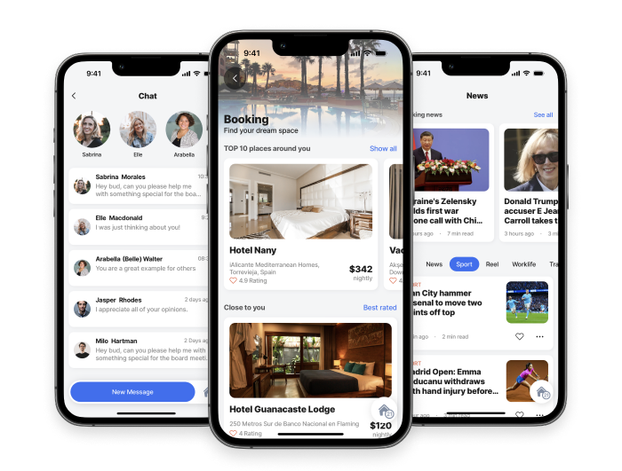
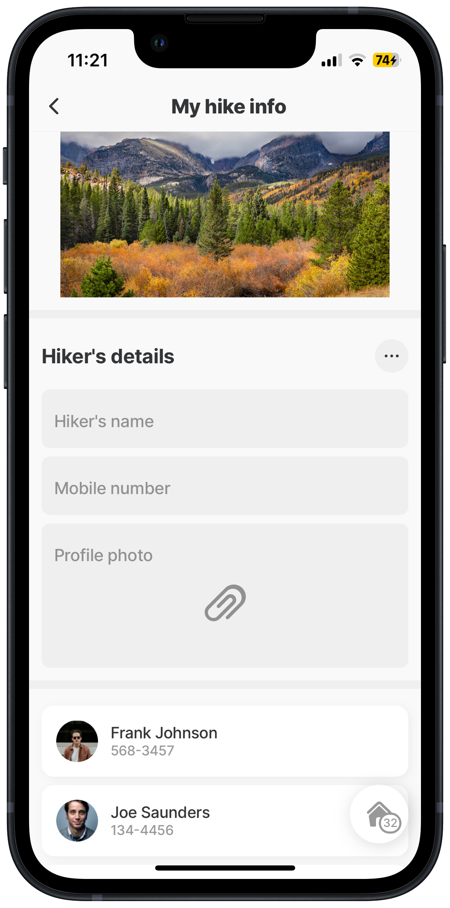
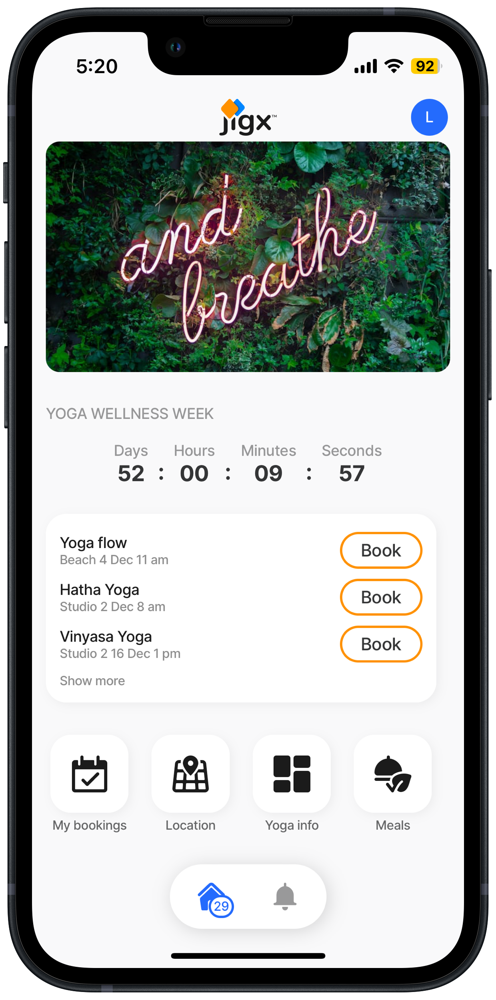

# Jigs (screens)

In Jigx we call screens in the app - jigs, there are different types of jigs depending on the type of layout you want in your app.

<figure><figcaption></figcaption></figure>

## Jig Types

The following jigs types are available:

<table><thead><tr><th width="139.6484375">Types</th><th width="352.1328125">Use</th><th>Code Examples</th></tr></thead><tbody><tr><td>Calendar</td><td>Use this jig to build a calendar to display scheduled events and create new events based on a date and time.</td><td><a href="https://docs.jigx.com/examples/readme/jig-types/jig_calendar">jig.calendar</a></td></tr><tr><td>Composite</td><td>This jig allows you to display multiple jigs on one screen where you would otherwise be unable to combine the functionality in the same way. For example, a form and list are on the same screen, where the form on completion populates the list with data.</td><td><a href="https://docs.jigx.com/examples/eadme/jig-types/jig_composite">jig.composite</a></td></tr><tr><td>Default</td><td>The default jig is the most versatile and provides the majority of functionality and a combination of different components and <a href="../actions.md">actions</a>. The most common use of a default jig is for forms and lists.</td><td><a href="https://docs.jigx.com/examples/readme/jig-types/jig_default">jig.default</a></td></tr><tr><td>Document</td><td>Used to show PDF files or HTML pages inside your app.</td><td><a href="https://docs.jigx.com/examples/readme/jig-types/jig_document">jig.document</a></td></tr><tr><td>Full-screen</td><td>Create a full screen to show a <a href="https://docs.jigx.com/examples/jigfullscreen#Yd92B">location</a> across the entire screen.</td><td><a href="https://docs.jigx.com/examples/readme/jig-types/jig_fullscreen#full-screen-of-a-map">jig.fullscreen</a></td></tr><tr><td>Grid</td><td>Create grid layouts in your app, organizing content into rows and columns for a visually consistent and flexible interface. It helps align elements proportionally, ensuring a structured design.</td><td><a href="https://docs.jigx.com/examples/readme/jig-types/jig_grid">jig.grid</a></td></tr><tr><td>List</td><td>Create lists of data and style these lists with elements such as <a href="https://docs.jigx.com/examples/readme/jig-types/jig_list#list-with-avatars">avatars</a>, or <a href="https://docs.jigx.com/examples/readme/jig-types/jig_list">images</a>. Make the list interactive by adding checkboxes and swipeable elements for updating or deleting the data in the list-item.</td><td><a href="https://docs.jigx.com/examples/readme/jig-types/jig_list">jig.list</a></td></tr><tr><td>Table</td><td>The table jig displays structured data in rows and columns, allowing users to view and interact with multiple records within the app.</td><td><a href="https://docs.jigx.com/examples/readme/jig-types/jig_table">jig.table</a></td></tr><tr><td>Tabs</td><td>Navigate between different jigs with ease, enhancing the user experience by providing an organized layout. These tabs are placed at the top of the screen to ensure a sleek and intuitive interface.</td><td><a href="https://docs.jigx.com/examples/readme/jig-types/jig_tabs">jig.tabs</a></td></tr></tbody></table>

## Considerations

* All jig files have the format _name.jigx_. You can add the name, and we will automatically add the extension.jigx for you.
* All jig files must be located under the jigs folder in Jigx Builder.
* [Jig Templates](jig-templates.md) are available for all the jig types, making it easy to insert and configure.
* For your jigs to be included in the app solution, they must either be added to the index.jigx file (to appear on the [home screen](../home-hub/home-hub.md)) or referenced by another jig that is included in the index.jigx, for example, is referenced by the [go-to](https://docs.jigx.com/examples/readme/actions/go-to) or [go-back](https://docs.jigx.com/examples/go-back) actions.
* A jig can be used to [create a home hub](../home-hub/creating-a-home-hub.md).
* [Group widgets](https://docs.jigx.com/examples/group) provide the functionality to be able to access jigs from inside other jigs.
* By default, the home button is visible on all jigs except the Home Hub. You can hide the home button on a jig if needed by setting the `isHomeButtonVisible` property to `false`.

## How to create a jig

<figure><figcaption></figcaption></figure>

1. Open Jigx Builder and [Create a Jigx solution](../../jigx-builder-code-editor/create-a-new-jigx-solution.md).
2. Right-click the jigs folder and select **New File...**
3. Type a unique name for the jig and press enter, the name must not contain any spaces. The jig file opens in the editor.
4. Use IntelliSense (cntrl + space) in the file and select the type of jig you will build.
5. Once the jig type is selected, the file populates with the core YAML structure ready for you to configure.
6. Add your values or remove the YAML that is not required, for example, if you do not want a header image at the top of the screen, remove the `header:` section.
7. The Jigx Builder validates the YAML; any issues are shown in red and need to be corrected before you can publish the solution.
8. If you want the jig to be accessed from the Home Hub, add the jig to the tabs in [index.jigx](../home-hub/index-settings.md) file. Otherwise, reference the jig from another jig for it to be included in the app.
9. [Publish](../../jigx-builder-code-editor/publishing-a-solution.md) the solution.

## How to edit a jig

1. Open your solution in Jigx Builder.
2. Click on the jig you want to edit, the editor opens.
3. Make the required changes.
4. Save and [publish](../../jigx-builder-code-editor/publishing-a-solution.md) the solution.

## How to delete a jig

1. Open your solution in Jigx Builder.
2. Click on the jig you want to edit, the editor opens.
3. Make the required changes.
4. Save and [publish](../../jigx-builder-code-editor/publishing-a-solution.md) the solution.

## How to combine jigs

There are two options available for joining jigs which depend on your requirements.

### 1.Create one screen that contains many jigs



<figure><figcaption><p>Four jigs combined into one</p></figcaption></figure>



* Use the `jig.composite` type to combine multiple jigs into one.
* Provide the `jigId` for each of the jigs to be included.
* The order of the `jigIds` configured in the YAML determines the order in which the jigs appear in the composite jig.
* There are properties available to hide the title of each jig (`isTitleHidden`).
* Provide `inputs` into each jig if required.



```yaml
title: My hike information
type: jig.composite

children:
  - jigId: hike-details
    isTitleHidden: false
  - jigId: hiking-friends
    isTitleHidden: true
  - jigId: hike-images
    isTitleHidden: true
  - jigId: Location
    isTitleHidden: true
```

### 2.Add widgets to a jig to navigate to other jigs



* Add the `widgets` property to a jig. Configure the `size` and `jigId` for all the jigs you want to navigate to from the current jig.
* The order of the `jigIds` configured in the YAML determines the order in which the widgets appear in the jig.



<figure><figcaption></figcaption></figure>



```yaml
title: Yoga Wellness Week
type: jig.default

datasources:
  yoga:
    type: datasource.sqlite
    options:
      provider: DATA_PROVIDER_DYNAMIC

      entities:
        - default/events

      query: SELECT
        id,
        '$.EventName',
        '$.StartDate',
        '$.Time',
        '$.Venue',
        '$.Type'
        FROM [default/events] WHERE '$.Type' = 'Yoga'

children:
  - type: component.image
    options:
      height: 200
      resizeMode: cover
      source:
        uri: https://images.unsplash.com/photo-1524901548305-08eeddc35080?w=700&auto=format&fit=crop&q=60&ixlib=rb-4.0.3&ixid=M3wxMjA3fDB8MHxzZWFyY2h8Nnx8Y2FsbXxlbnwwfHwwfHx8MA%3D%3D

  - type: component.section
    options:
      title: Yoga Wellness Week
      children:
        - type: component.countdown
          options:
            size: medium
            expiresAt: "2024-01-25T17:30:00+02:00"

  # Add widgets to the jig to allow for navigation between jigs.
  - type: component.widgets
    options:
      children:
        - size: "4x2"
          jigId: yoga-list
        - size: "1x1"
          jigId: my-bookings
        - size: "1x1"
          jigId: yoga-location
        - size: "1x1"
          jigId: yoga-info
        - size: "1x1"
          jigId: yoga-meals
```

## How to pass data from one jig to another (input & outputs)

In certain scenarios, there is a need to transfer data, such as customer IDs or opportunity IDs, from one jig to another. This can be effectively accomplished by utilizing inputs and outputs. See [Passing data using inputs](passing-data-using-inputs.md) and [Passing data using outputs](passing-data-using-outputs.md) to understand the configuration options.

## See Also

The following examples with code snippets are provided:

1. [jig.calendar](https://docs.jigx.com/examples/jigcalendar)
2. [jig.default](https://docs.jigx.com/examples/jigdefault)
3. [jig.document](https://docs.jigx.com/examples/readme/jig-types/jig_document)
4. [jig.list](https://docs.jigx.com/examples/jiglist)
5. [jig.composite](https://docs.jigx.com/examples/jigcomposite)
6. [jig.fullscreen](https://docs.jigx.com/examples/jigfullscreen)
