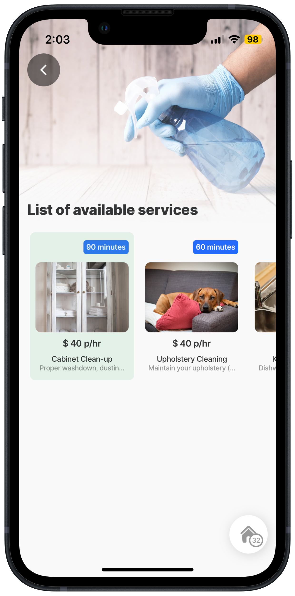
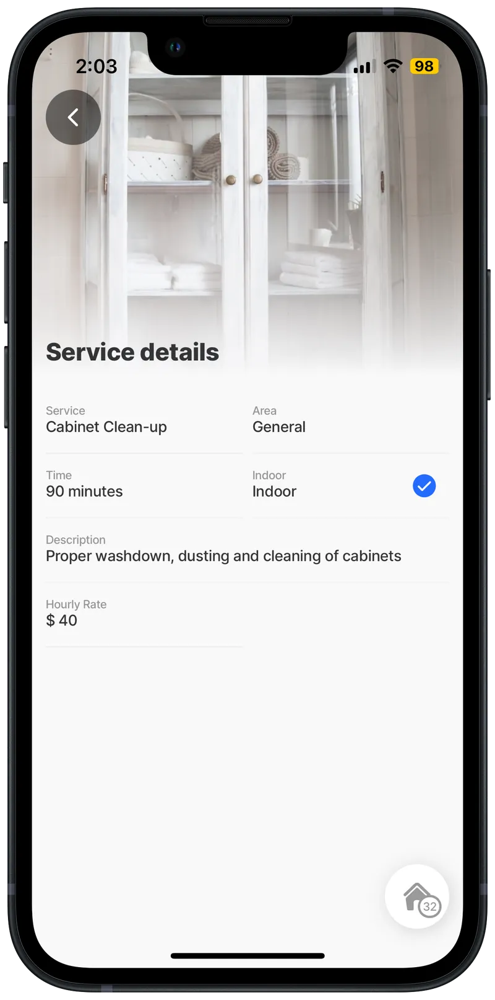

---
layout:
  width: wide
  title:
    visible: true
  description:
    visible: true
  tableOfContents:
    visible: true
  outline:
    visible: true
  pagination:
    visible: true
  metadata:
    visible: true
---

# Passing data using outputs

Often, you need to transfer or pass data between jigs to provide context and data, for example, when pressing on a customer in a list, the customer ID is passed to the order form, prepopulating the customer's details. This is accomplished by utilizing [inputs](passing-data-using-inputs.md) and outputs.

## Outputs

<figure><figcaption><p>Output and inputs</p></figcaption></figure>

Outputs are configured in a jig and are then used as an input in a composite jig to pass data between the jigs in the composite jig. This configuration is suitable for creating master detail screens, clicking on a component in one jig, populates the components and data in the next screen. Passing data values between jigs works both ways.

### Considerations

* An `instanceId` is required for the jig that is exposing an `output` in order to access the output via `state` from another jig.
* The data from configuring `outputs` can only be used in composite jigs.
* Using the `output` property must be reciprocated with an `input` property in the composite jig.
* The `output` requires an `output-key` and a data value that is available in that jig.
* The receiving jig configuration uses the format similar to `=@ctx.solution.state.output-key`. Use IntelliSense (ctrl+space) to assist with configuration.

### YAML code

The `output` and `input` work in conjunction with each other.



**Output:** In the jig containing the data you want to transfer, configure the output-key. \
Example:


```yaml
outputs: output-key: =@ctx.solution.state.servicesId
```




**Input:** In the receiving [jig.composite](https://docs.jigx.com/examples/jigcomposite) configure the input for the data. \
\
Example:


```yaml
inputs: id: =@ctx.solution.state.servicesId
```




## Examples

### Passing data via outputs to connect two jigs data in a composite jig

In this example, cleaning services are listed, initially the service details are blank showing a placeholder. Once the service is selected from the List of available services, the service details for that specific service populates.

<figure><figcaption><p>Passing data using outputs</p></figcaption></figure>

**Output Jig - available services**



Create a horizontal `jig.list` to show the available services with a `leftElement` for the image and `rightElement` for the text values. Add the `output:` `output-key` property and use the jig state for the active item `=@ctx.solution.state.servicesId`



<figure><figcaption><p>Available services list</p></figcaption></figure>





```yaml
title: List of available services
type: jig.list
icon: contact
isHorizontal: true
isCollapsible: false
isInitiallyCollapsed: true
hasActiveItem: true
isSelectable: true

header:
  type: component.jig-header
  options:
    height: medium
    children:
      type: component.image
      options:
        source:
          uri: https://images.unsplash.com/photo-1628177142898-93e36e4e3a50?ixlib=rb-1.2.1&ixid=MnwxMjA3fDB8MHxwaG90by1wYWdlfHx8fGVufDB8fHx8&auto=format&fit=crop&w=2070&q=80

outputs:
  output-key: =@ctx.solution.state.servicesId

data: =@ctx.datasources.cleaning-services-dynamic
item:
  type: component.list-item
  options:
    title: =@ctx.current.item.service
    subtitle: =@ctx.current.item.description
    horizontalItemSize: large

    progress: =@ctx.current.item.id = @ctx.solution.state.servicesId ? 1 :0
    color:
      - when: =@ctx.current.item.id = @ctx.solution.state.servicesId ? true :false
        color: color2
    leftElement:
      element: image
      text: ""
      uri: =@ctx.current.item.image
    label:
      title: =@ctx.current.item.time & ' minutes'
    rightElement:
      element: value
      text: =(@ctx.current.item.hourlyrate) != 'NA' ? '$ ' & $number(@ctx.current.item.hourlyrate) & ' p/hr':'$ ' & $number(@ctx.current.item.onceoffrate) & ' once off'
    onPress:
      type: action.action-list
      options:
        actions:
          # set the solution state and the value as id of the current selected item
          - type: action.set-state
            options:
              state: =@ctx.solution.state.servicesId
              value: =@ctx.current.item.id
```



```yaml
type: datasource.sqlite
options:
  provider: DATA_PROVIDER_DYNAMIC

  entities:
    - entity: default/cleaning-services

  query: |
    SELECT 
      id, 
      '$.id' as sqlid, 
      '$.area', 
      '$.description', 
      '$.hourlyrate', 
      '$.illustration', 
      '$.image', 
      '$.indoor', 
      '$.onceoffrate', 
      '$.service', 
      '$.pressed', 
      '$.time',
      '$.quantity'
    FROM [default/cleaning-services] WHERE '$.hourlyrate' IS NOT NULL ORDER BY id DESC
```



**Jig - service details**



<figure><figcaption><p>Service detail jig</p></figcaption></figure>



Create a default jig with `component.entity` to display the various details such as service name, time, and cost. Define the datasource and configure a&#x20;


```yaml
queryParameters: servId: =@ctx.solution.state.servicesId
```





```yaml
title: =@ctx.datasources.cleaningServices.service != null ? "Service details":" "
type: jig.default
placeholders:
  - title: Please choose a service
    when: =@ctx.datasources.cleaningServices.service != null ? false:true
    icon: loading-data

datasources:
  cleaningServices:
    type: datasource.sqlite
    options:
      provider: DATA_PROVIDER_DYNAMIC

      entities:
        - entity: default/cleaning-services
      queryParameters:
        servId: =@ctx.solution.state.servicesId

      query: |
        SELECT 
          id,
          '$.area', 
          '$.description',
          '$.hourlyrate',
          '$.illustratuion',
          '$.image',
          '$.indoor',
          '$.onceoffrate',
          '$.service',
          '$.time' 
        FROM [default/cleaning-services] WHERE id = @servId

header:
  type: component.jig-header
  options:
    height: medium
    children:
      type: component.image
      options:
        source:
          uri: =@ctx.datasources.cleaningServices.image

children:
  - type: component.entity
    options:
      children:
        - type: component.field-row
          options:
            children:
              - type: component.entity-field
                options:
                  label: Service
                  value: =@ctx.datasources.cleaningServices.service
              - type: component.entity-field
                options:
                  label: Area
                  value: =@ctx.datasources.cleaningServices.area
        - type: component.field-row
          options:
            children:
              - type: component.entity-field
                options:
                  label: Time
                  value: =@ctx.datasources.cleaningServices.time & ' minutes'
              - type: component.entity-field
                options:
                  label: Indoor
                  value: =@ctx.datasources.cleaningServices.indoor
                  contentType: checkbox
        - type: component.entity-field
          options:
            label: Description
            value: =@ctx.datasources.cleaningServices.description
            isMultiline: true
        - type: component.field-row
          options:
            children:
              - type: component.entity-field
                options:
                  label: Hourly Rate
                  value: =(@ctx.datasources.cleaningServices.hourlyrate) != 'NA' ? '$ ' & $number(@ctx.datasources.cleaningServices.hourlyrate):'NA'
              - type: component.entity-field
                options:
                  label: Once Off Rate
                  value: ='$ ' & $number(@ctx.datasources.cleaningServices.onceoffrate)
                  isHidden: =(@ctx.datasources.cleaningServices.onceoffrate) = null ? true:false
```


**Composite jig - combining output with input**



Create a `jig.composite` and add the `jigIds` for both jigs above. Give the jig configured with the output an `instanceId` and the jig that receives the output an `input` property.



<figure><figcaption></figcaption></figure>




You have to provide an `instanceId` for the jig that is exposing an output in order to access the output via state from another jig.



```yaml
type: jig.composite
title: Cleaning Services

header:
  type: component.jig-header
  options:
    height: medium
    children:
      type: component.image
      options:
        source:
          uri: https://images.unsplash.com/photo-1512314889357-e157c22f938d?ixlib=rb-1.2.1&ixid=MnwxMjA3fDB8MHxzZWFyY2h8MXx8aW5mb3JtYXRpb258ZW58MHx8MHx8&auto=format&fit=crop&w=900&q=60

children:
  - jigId: cleaning-serv-horizon-list-dd
    instanceId: cleaning
  # InstanceId is required for a composite jig exposing outputs
  # To be accessed by another jig

  - jigId: service-details
    instanceId: service_deets
    # Add inputs to receive the outputs-keys, use the instanceId of the output jig
    # Which renders the selected data
    inputs:
      id: =@ctx.jigs.cleaning.outputs.output-key
```

