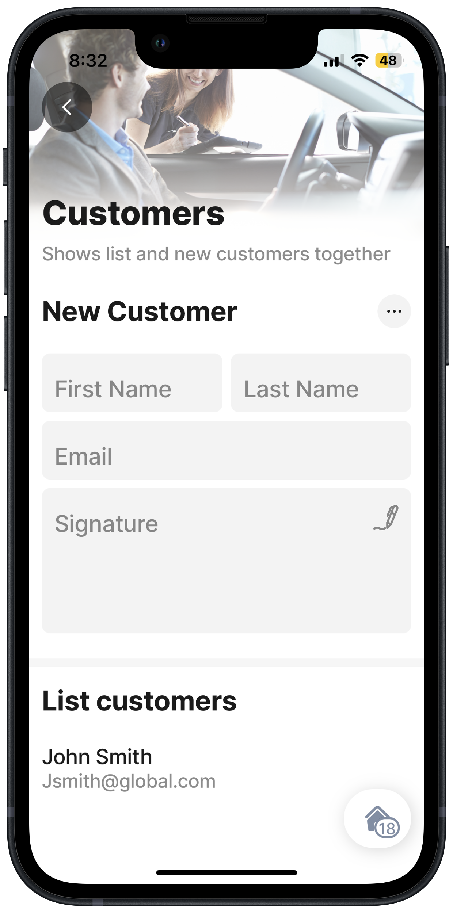
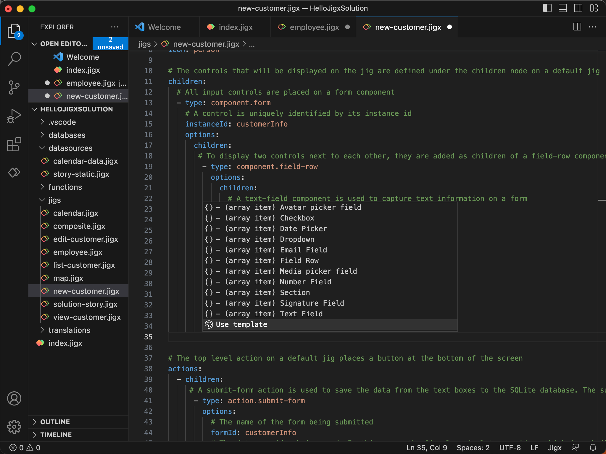
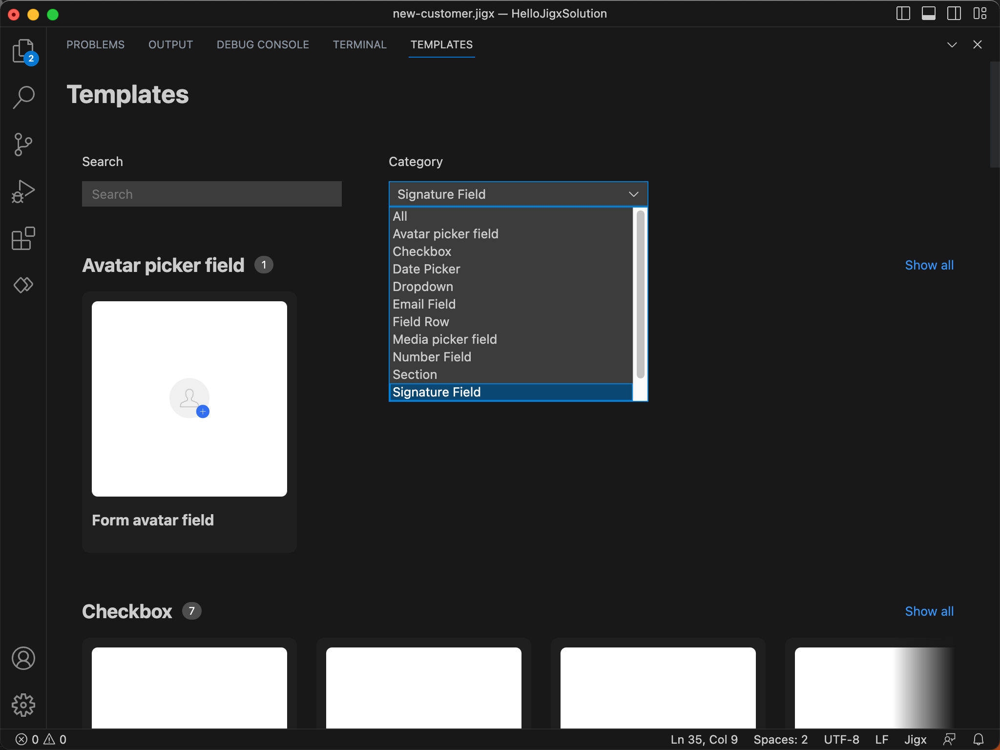
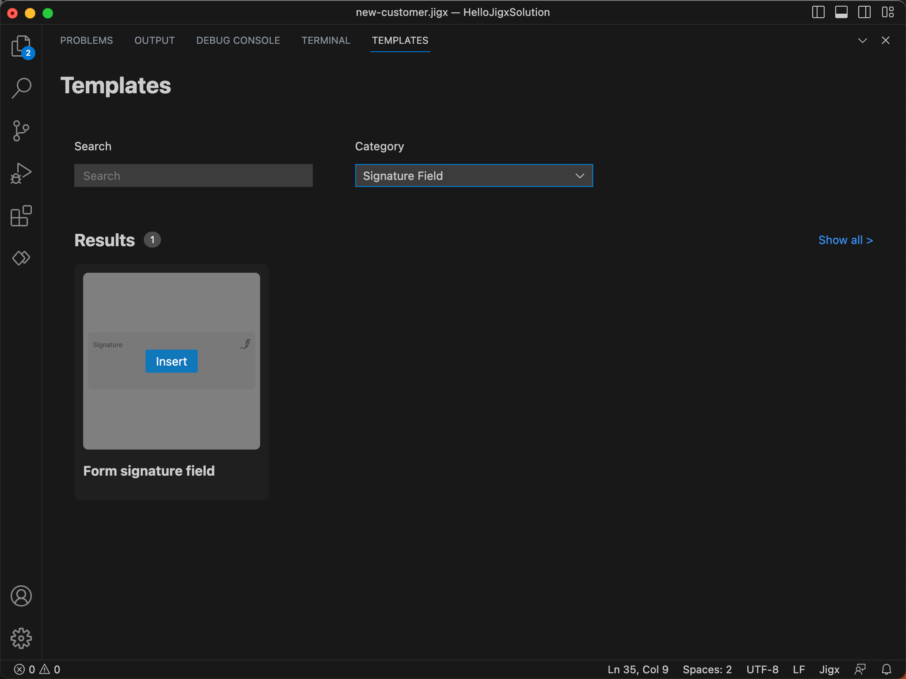
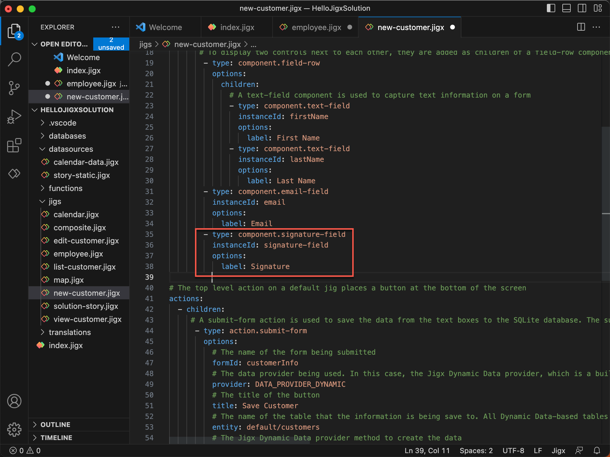

# Add a component using a template

We have used the default jig template to add a profile jig to the project in the previous step. Let's go ahead and add a component template. Component templates allow you to quickly build up your solution by inserting the required component into the jig file.

In our solution, we have a new customer form, when we signup the new customer we want them to sign the form. Let's use the signature component template to do this.

<figure><figcaption>
Signature component template
</figcaption></figure>

1. In Explorer in the **jigs** folder, right-click on the **new-customer.jigx** file.
2. Components are normally added under a `children` node in the YAML. Under the last `component.email-field` section just above the `actions` node place your cursor in the correct node position in the YAML editor and press the **ctrl+space** keys. The Jigx component IntelliSense popup displays listing the available components.

<figure><figcaption>
Component template
</figcaption></figure>

3\. Scroll to the bottom and select **Use template**. The template gallery opens providing the templates for various components. Use the _Search_ and _category_ fields to find the signature template or browse the gallery by scrolling through the options.

<figure><figcaption>
Template gallery
</figcaption></figure>

4\. Hover over the**Form signature field** template and click the blue **insert** button.

<figure><figcaption>
Insert template
</figcaption></figure>

5\. The template YAML will be inserted into your jig file.

<figure><figcaption>
Inserted YAML
</figcaption></figure>

6\. Publish your project and tap on the new customer widget on the Home Hub in the app. See the signature component on the form.
