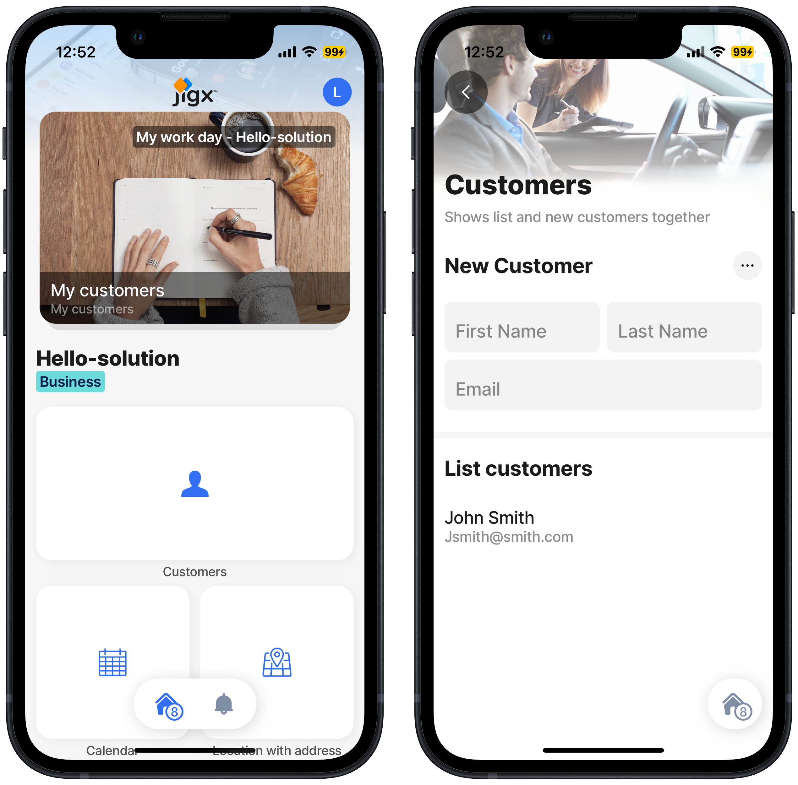

---
layout:
  width: wide
  title:
    visible: true
  description:
    visible: true
  tableOfContents:
    visible: true
  outline:
    visible: true
  pagination:
    visible: true
  metadata:
    visible: true
---

# Combine the solution's elements

In the Build your first Jigx solution steps, you have already built a map using the [jig.default](https://docs.jigx.com/examples/jigdefault), added a calendar using the [jig.calendar](https://docs.jigx.com/examples/jigcalendar), added a new customer form using the [jig.default](https://docs.jigx.com/examples/jigdefault), and a customer list using [jig.list](https://docs.jigx.com/examples/jiglist).

Now you can expand the solution further by using the [jig.composite](https://docs.jigx.com/examples/jigcomposite) type to group the new customer jig and the customer list jig into one jig, and add a jig header to the new customer jig.


We recommend you build out all the solution steps for the [Create an app from scratch](combine-the-solution_s-elements.md), as each solution step builds on the previous step until you have a functioning mobile app.




## Steps

1. Open the Hello-Jigx - Solution in Jigx Builder in VS Code.
2. [Add the customer composite jig](add-the-customer-composite-jig.md) file that joins the new customer form and list into one jig using the new-customer and list-customer `jigIds` and add a `header` for the jig.
3. [Edit the index.jigx file](edit-the-index_jigx-file.md), add the customer composite jigId, remove the new customer and the list customer jigIds.
4. [Publish your project](../create-the-calendar/publish-your-project.md).
5. [Run the updated solution](../run-the-updated-solution.md) in the Jigx mobile app, click on each jig to view the solution, note on the customer jig the form, and list display in the same jig.



<figure><figcaption></figcaption></figure>



## GitHub Samples

You can download the [Hello Jigx solution](https://github.com/jigx-com/jigx-samples/tree/main/quickstart/hello-jigx-solution) project on GitHub or build it yourself by following the detailed steps in this section.
