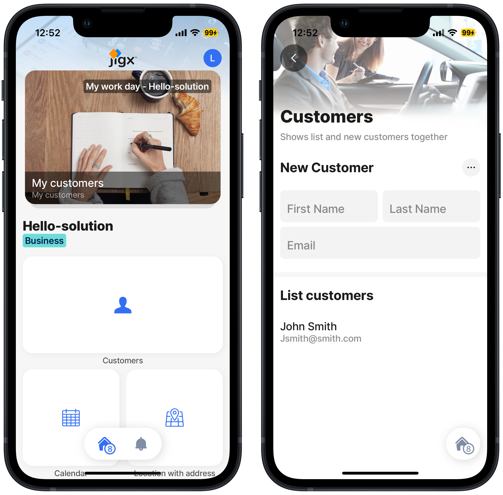

# Run the Hello Jigx Solution

With the final update to the Hello Jigx solution published on the server, you are ready to use the solution in the Jigx mobile app.



## Steps

1. On your mobile device **tap** the Jigx app icon on your mobile device.
2. Sign into the app with your [Jigx account](../../creating-an-account.md) details.
3. Notice the customer composite widget. Tap the widget to see the customer header, form, and list.



<figure><figcaption></figcaption></figure>



**Congratulations** you have successfully built your first functioning Jigx solution. Explore the solution by adding new customers or extend the solution by adding to the existing code by [customizing the solution](../customize-the-hello-jigx-solution/customize-the-hello-jigx-solution.md).
