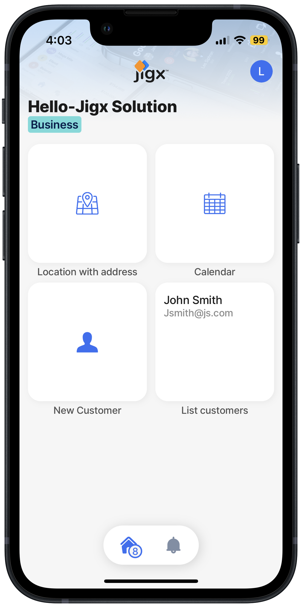
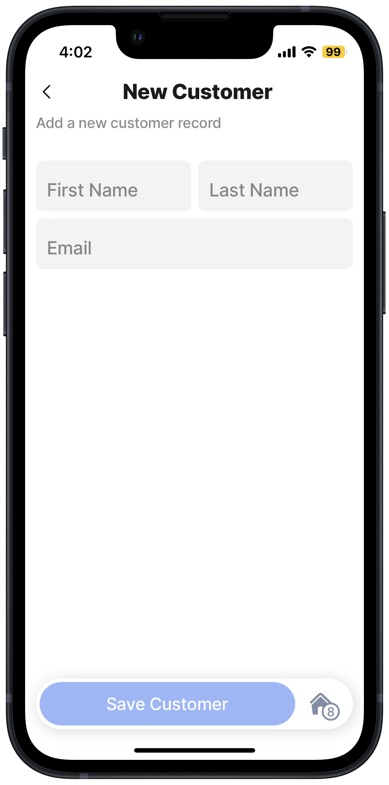
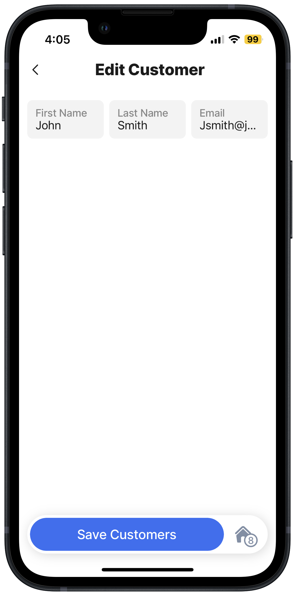

---
layout:
  width: wide
  title:
    visible: true
  description:
    visible: true
  tableOfContents:
    visible: true
  outline:
    visible: true
  pagination:
    visible: true
  metadata:
    visible: true
---

# Create Data - Form & List

## Overview

Learn how to build [forms](../../../building-apps-with-jigx/ui/jigs-_screens_/forms/forms.md) that create a new customer record that gets stored in the built-in Jigx data store called [Dynamic Data](../../../building-apps-with-jigx/data/data-providers/dynamic-data/dynamic-data.md). The data record is created in the data store by using the submit [action](https://docs.jigx.com/examples/readme/actions). Once the record is created you can view, edit and list the data records using queries that return the record details from SQLite. For more information on the supported data providers read the [Data](../../../building-apps-with-jigx/data/data.md) section.


There are **two methods** to save data collected on a form to a database.

**The first method is to use the form submit action.** The submit form action automatically matches the `instanceIds` of the controls on the jig and creates a record in the local SQLite table with each `instanceIds` as a property for the JSON object in the Data column.

**The second method is to use an execute entity action.** The execute entity action allows you to specify the data properties for the SQLite table. You have more granular control over the saved values and can include expressions.




<figure><figcaption>
Form and list widgets
</figcaption></figure>



<figure><figcaption>
New customer form
</figcaption></figure>





<figure><figcaption>
View customer jig
</figcaption></figure>



<figure><figcaption>
Edit customer jig
</figcaption></figure>




We recommend you build out all the solution steps for the [Create an app from scratch](create-data-form-_-list.md), as each solution step builds on the previous step until you have a functioning mobile app.


## Steps

1. Open the Hello-Jigx solution in the Jigx Builder in VS Code.
2. [Create a new customer form](create-a-new-customer-form.md): Add the `new-customer.jigx` file with type `jig.default`, the form uses a two-column layout. Add the `component.form` to create the three fields on the form. Add the `action.submit-form` to submit the form data to the Jigx SQLite dynamic data store.
3. [Create a customer list with data](create-a-customer-list-with-data.md) Add the `list-customer.jigx` file with type `jig.list`. Specify the dynamic data provider and the `query` that returns the customer's details in the list.
4. [Create a view of the customer record](create-a-view-of-the-customer-record.md): Add the `view-customer.jigx` file with type `jig.default`, specify the `datasource.sqlite`, and the `query` to return a view of the customer and their details.
5. [Edit a customer record](edit-a-customer-record.md): Add the `edit-customer.jigx` file with type `jig.default`, specify the `datasource.sqlite`, the `query` to return the specified customer and their details. Add `component.form` to display the returned data. Then add the `action.submit-form` with the `method: update` to save the changes to the customer's details.
6. [Add the form & list to the Home Hub](add-the-form-_-list-to-the-home-hub.md) by adding their `jigIds` to the `tabs` in the `index.jigx` file.
7. [Publish your project](../create-the-calendar/publish-your-project.md).
8. [Run the updated solution](../run-the-updated-solution.md) in the Jigx mobile app, click on the customer icon, this opens a new customer form. Add details for a customer. Tap back to return to the Home Hub , the customer will appear in the customer list widget. You can view the customer by tapping on the customer name in the list.

## GitHub Samples

You can download the [Hello Jigx solution](https://github.com/jigx-com/jigx-samples/tree/main/quickstart/hello-jigx-solution) project on GitHub or build it yourself by following the detailed steps in this section.
