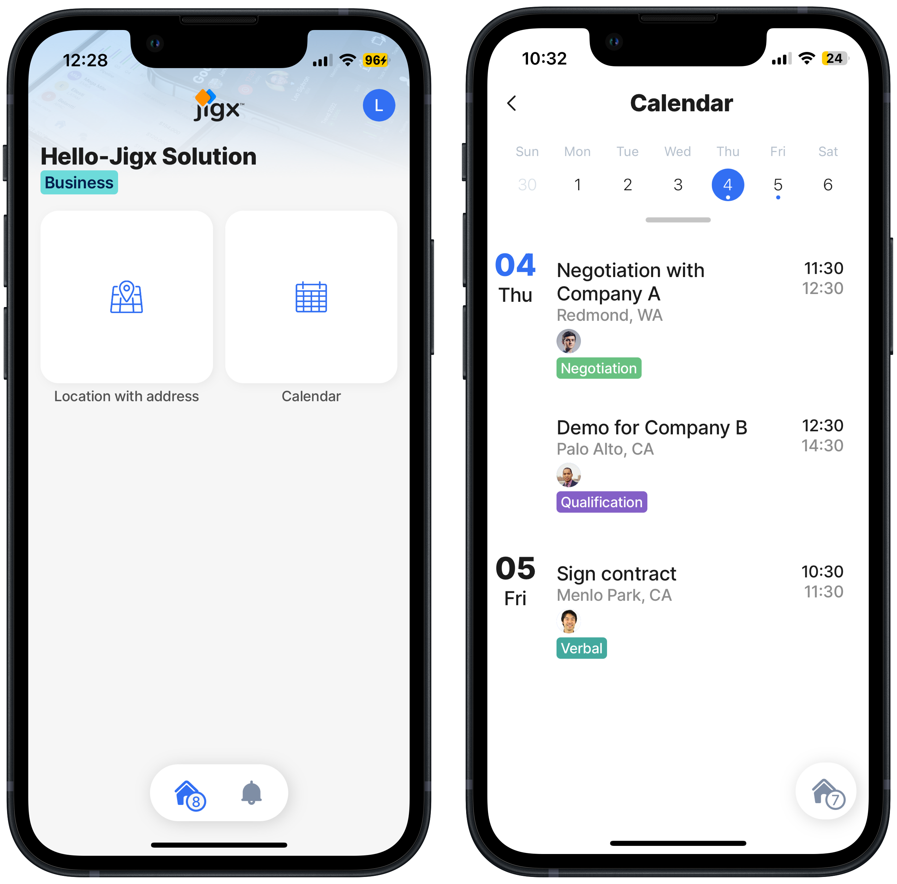

---
layout:
  width: wide
  title:
    visible: true
  description:
    visible: true
  tableOfContents:
    visible: true
  outline:
    visible: true
  pagination:
    visible: true
  metadata:
    visible: true
---

# Create the Calendar

## Overview

Learn how to add a second jig to your Hello Jigx project using the _**jig.calendar**_ type with an icon and a [static data source](https://docs.jigx.com/examples/static). At the end of this step-by-step, you have added a calendar jig to the [Home Hub](../../../building-apps-with-jigx/ui/home-hub/home-hub.md) that can display a week, the events, meetings, and the relevant details for each, as shown below.


We recommend you build out all the solution steps for the [Create an app from scratch](create-the-calendar.md), as each solution step builds on the previous step until you have a functioning mobile app.




### Steps

1. Open the Hello-Jigx solution in the Jigx Builder in VS Code.
2. [Add the calendar jig and datasource](add-the-calendar-jig-and-datasource.md) with an icon, and static data source.
3. [Publish your project](../create-data-form-_-list/publish-your-project.md).
4. [Run the updated solution](../run-the-updated-solution.md) in the Jigx mobile app, click the calendar icon, and view the week's meetings and events.&#x20;



<figure><figcaption></figcaption></figure>



### GitHub Sample

You can download the [Hello Jigx solution project](https://github.com/jigx-com/jigx-samples/tree/main/quickstart/hello-jigx-solution) on GitHub or build it yourself by following the detailed steps in this section.
