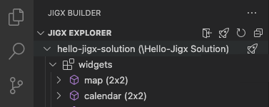

# Publish your project

## Overview

With the calendar jig added to the Hello Jigx project, you are ready to publish the solution to the Jigx Cloud. If you are the owner of the solution, you do not need your Jigx app credentials again to publish the update.



### Steps

1. In VS Code click on the **Jigx Builder** icon in the left navigation bar.
2. In the Jigx Explorer hover over the Hello Jigx node till you see the **publish icon (rocket)**. Click on the icon to start the publishing process.
3. Click **Publish** on the confirmation message screen.
4. The publishing process starts, and the progress shows in the bottom right corner of the VS Code editor. A message displays when the solution is successfully published.&#x20;



<figure><figcaption></figcaption></figure>




You can use the shortcut keys straight from the file you in:

* Publish all files in Jigx solution on Mac is `⌘R⌘R`, and on Windows is `Alt+R Alt+R`
* Publishing an individual file on Mac is `⌘R⌘F`, and on Windows is `Alt+R Alt+F`&#x20;

