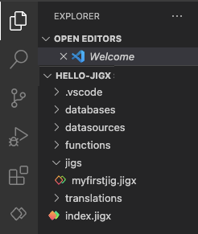

# Create the Hello Jigx Solution project

Every solution you build is contained in a Jigx project. You can name your solution, select from a predefined list of categories and determine where the solution files will be located, which could be locally, or you can connect VS Code to a GitHub repository. Your project is preloaded with the required Jigx files ready for you to configure.


We recommend you build out all the solution steps for the [Create an app from scratch](create-an-app-from-scratch.md), as each solution step builds on the previous step until you have a functioning mobile app.




## Steps

1. Open VS Code, and click on the Jigx Builder **icon** in the left navigation bar. Select the **Create New Jigx Solution** button.
2. Type **Hello-Jigx** in the Solution title field and press enter. This name displays at the top of your solution on the Home Hub in the Jigx App.
3. The Solution name field pre-populates with the solution's system name. Jigx derives the system name from the solution title you provided in the previous step. You can provide a different solution name if you want. Take note of the following naming restrictions:
   1. Cannot start with a number.
   2. No spaces are allowed. Hyphens replace spaces.
   3. Must be in lowercase.
4. Select a relevant category where you want the solution saved. The category you select displays at the top of your solution in the [Home Hub](../../building-apps-with-jigx/ui/home-hub/home-hub.md). For this solution select the **business** category. Select a local folder where the project files are saved too. Your Jigx default solution files open in the VS Code editor with the .jigx extensions ready for editing.



<figure><figcaption>
Jigx project in VS code
</figcaption></figure>



## See Also

* [Jigx overview](<../../Understanding the basics/Architecture.md>)
* [Jigx Concepts](<../../Understanding the basics/Jigx Concepts.md>)
