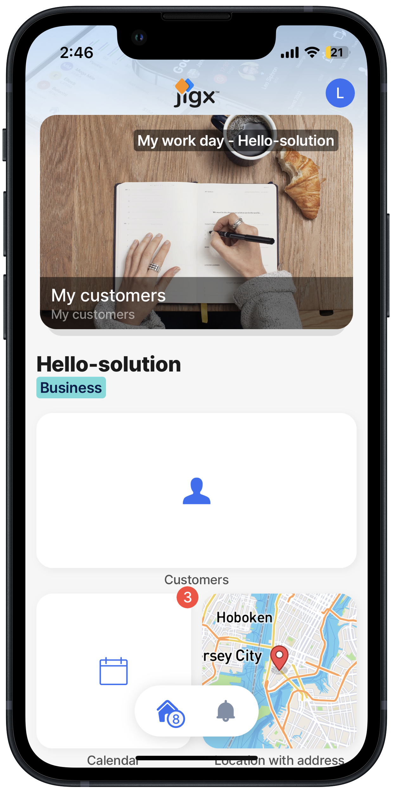

# Add widgets

## Overview

Widgets can be customized in many ways to reflect the styling and functionality you require. Use the widget [image](add-widgets.md), [location](add-widgets.md), [chart](add-widgets.md), and other elements for customizations. In this section, you will learn how to change your map jig with an icon to a `widget.location`, and add a `widget.image` widget to the `composite.jigx` file.



<figure><figcaption><p>Hello Jigx solution with location icon</p></figcaption></figure>



<figure><figcaption><p>Widget location &#x26; image</p></figcaption></figure>



#### Steps

#### Add a widget to a jig

1. Open the Hello-Jigx solution in Jigx Builder in VS Code, and click on the map.jigx file.
2. Delete the `icon: location` entry.
3. Add the `widget.location` code below. For the address you use [expressions](../../../building-apps-with-jigx/logic/expressions.md) to call the city New York from the static datasource.


Expressions are JSONata language-based. Learn more about [JSONata](https://jsonata.org/) and try out your expressions in their [JSONata Exerciser](https://try.jsonata.org/). The root element of Expressions in .jigx files always starts with "@ctx" vs. "$$." in JSONata Exerciser (e.g. @ctx.data vs.$$.data). Jigx supports shorthand $ expressions for JSONata.



```yaml
# The system name that uniquely identifies the jig
title: Location with address
# The jig type used to display data
type: jig.default

isCollapsible: true
# The type of datasource used to return data in the jig
datasources:
  address: 
    # The static dataset is created directly inside the jig file
    type: datasource.static
    options:
      data:
        - street: 768 5th Ave
          city: New York
          country: US
# The control used by the jig          
children:
  - type: component.location
    options:
      viewPoint:
        address: =@ctx.datasources.address.street & ',' & @ctx.datasources.address.city & ',' & @ctx.datasources.address.country
        zoomLevel: 9
# The widget that displays on the home hub.    
widgets: 
  map-location: 
    type: widget.location
    options: 
      viewPoint: 
       address: =@ctx.datasources.address.city        
```


4\. Open the `composite.jigx` file and copy the code below. Note the new widgets section using `widget.image` showing a source uri for the image you want displayed.


```yaml
# The system name that uniquely identifies the jig
title: Customers
description: Shows list and new customers together
# The jig type used to join multiple jigs together
type: jig.composite

widgets:
  image:
    type: widget.image
    options:
      source: 
        uri: https://cdn2.webdamdb.com/v1_1280_6enPaxIBt9M3.jpg?1554490336
        
# A container for specifying jig headers such as images, videos or location
header:
  type: component.jig-header
  options:
    children:
      type: component.image
      options:
        title: Customers
        source:
          uri: https://cdn2.webdamdb.com/v1_1280_6enPaxIBt9M3.jpg?1554490336
    height: small    
  
# Specifiy the jigs to combine by listing the jigIds for each jig
children:
  - jigId: new-customer
  - jigId: list-customer
```


5\. **Save** and **publish** the Hello-Jigx solution. 6. **Run** the Hello-Jigx solution on your mobile device to see the change to the map widget on the Home Hub.
