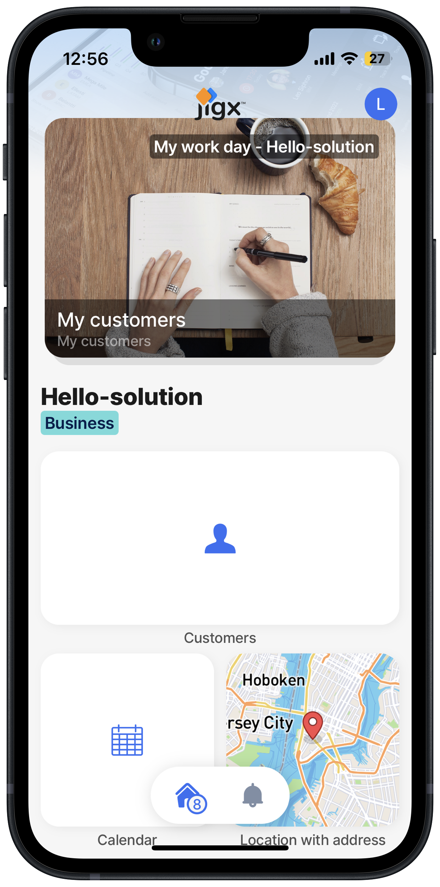
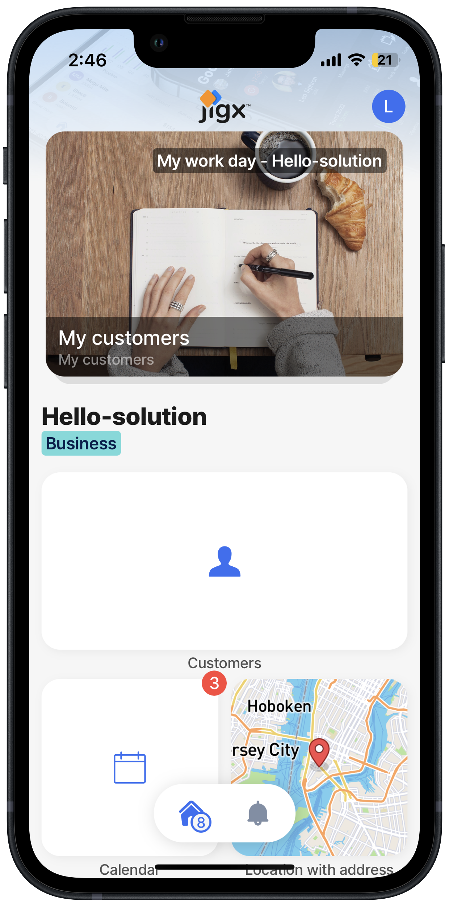

---
layout:
  width: wide
  title:
    visible: true
  description:
    visible: true
  tableOfContents:
    visible: true
  outline:
    visible: true
  pagination:
    visible: true
  metadata:
    visible: true
---

# Change an icon and add a badge

## Overview

You can easily customize widgets on the Home Hub by changing their icons and adding additional components such as badges to the widgets. In this section, you learn to change the calendar icon and add a badge [using an expression](../../../building-apps-with-jigx/logic/expressions.md) on the calendar jig to show the number of calendar events for the week.


For a view of the icons in a list see the _Types - List - List with all icons_ in the _jigx-samples solution_ available in [https://manage.jigx.com/quickstartQuick ](https://manage.jigx.com/quickstart)start.




<figure><figcaption><p>Solution with Calendar -3 icon</p></figcaption></figure>



<figure><figcaption><p>Solution with calendar badge</p></figcaption></figure>



#### Steps

#### Change an widget icon

1. Open the Hello-Jigx solution in Jigx Builder in VS Code, click on the calendar.jigx file.
2. Replace `icon: calendar-3` with `icon: calendar`.

#### Add a badge to the calendar widget

1. Under icon add a new line for the badge code that shows the number of calendar events for the week. Add `badge:` Then use the `=$count(@ctx.datasources.calendar-data.id)` [expression](../../../building-apps-with-jigx/logic/expressions.md) to count the events in the calendar and show the number in the badge on the Home Hub.


Expressions are JSONata language-based. Learn more about [JSONata](https://jsonata.org/) and try out your expressions in their [JSONata Exerciser](https://try.jsonata.org/). The root element of Expressions in .jigx files always starts with "@ctx" vs. "$$." in JSONata Exerciser (e.g. @ctx.data vs.$$.data). Jigx supports shorthand $ expressions for JSONata.



```yaml
# The system name that uniquely identifies the jig
title: Calendar
# The jig type used to display a calendar with the current date
type: jig.calendar
# icon that displays on the widget on the home hub
icon: calendar
# Add a badge to the calendar widget and use an expression to count the entries in the calendar by id
badge: =$count(@ctx.datasources.calendar-data.id)
# The expression that structures the data from the datasource before binding it to the jig. Expressions are JSONata based
data: =@ctx.datasources.calendar-data
item:
  options:
    title: =@ctx.current.item.title
    from:
      format:
        dateFormat: lll
      text: =$fromMillis($toMillis($now()) + @ctx.current.item.eventStart * 3600000)
    location: =@ctx.current.item.location
    people: =@ctx.current.item.people
    tags: =@ctx.current.item.tags
    to:
      format:
        dateFormat: lll
      text: =$fromMillis($toMillis($now()) + @ctx.current.item.eventEnd * 3600000)
  type: component.event
```


4\. **Save** and **publish** the Hello-Jigx solution. 5. **Run** the Hello-Jigx solution on your mobile device to see the change to the calendar icon and see the badge displaying 3 events for the week on the Home Hub.
