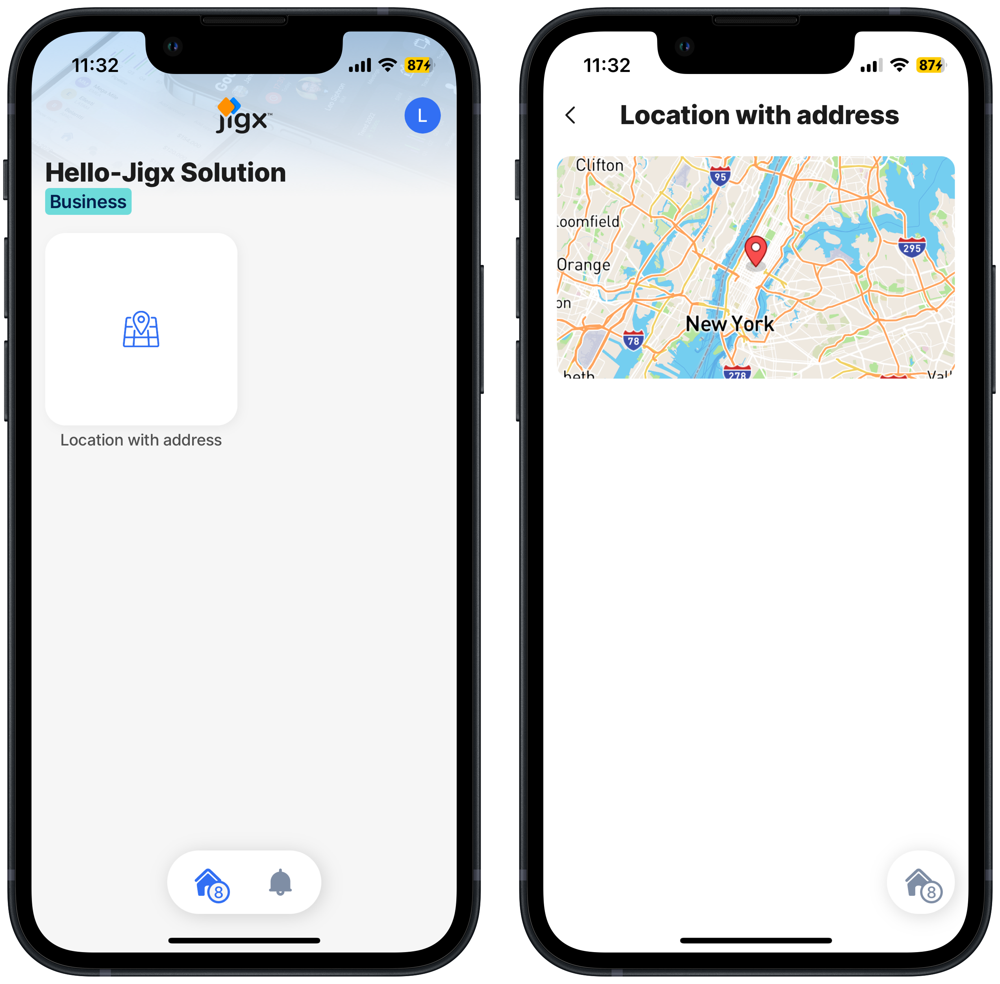

# Run the solution in the app

With the Hello Jigx solution published to the Cloud, you are ready to use the solution in the Jigx mobile app.



## Steps

1. On your mobile device **tap** the Jigx app icon.
2. Sign into the app with your [Jigx account](../creating-an-account.md) details.
3. The app opens the [Home Hub](../../building-apps-with-jigx/ui/home-hub/home-hub.md) screen displaying the Hello Jigx solution, with the map widget and location icon.
4. Tap on the icon to display the location on the map.&#x20;




<figure><figcaption>
Map jig on Home Hub
</figcaption></figure>




As you build and publish more solutions to your Jigx mobile app, you can toggle between the solutions by clicking on the home icon, and selecting the solution you want to use. The number badge on the home icon shows how many solutions are available to you.


**Congratulations** you have built, published, and used the Hello Jigx solution. Why not try building the next step in the [Build your first Jigx solution](https://docs.jigx.com/run-the-solution-in-the-app).

## See Also

* [Jigx overview](docId:BrcaJaBz2U-kT_VaaWOrj)
* [Jigx Concepts](docId:onEMnBqUmgBn6N4kaRYTs)
