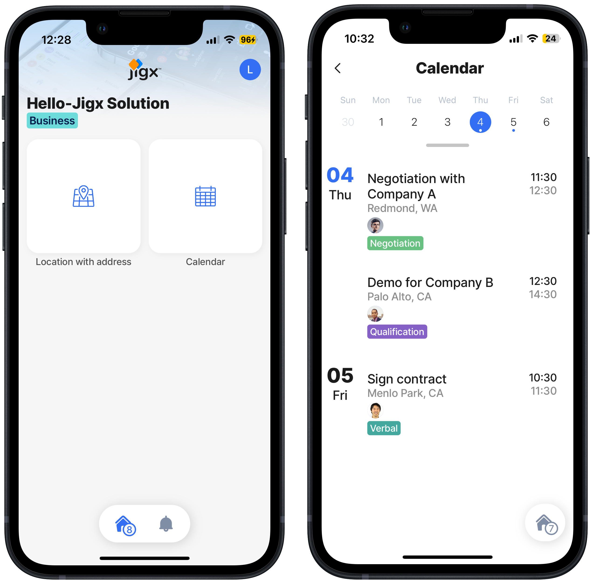

# Run the updated solution

With the Hello Jigx project published to the Cloud, you are ready to use the solution in the Jigx mobile app.



## Steps

1. On your mobile device, **tap** the Jigx app icon.
2. Sign into the app with your [Jigx account](../creating-an-account.md) details.
3. The app opens the [home hub](../../building-apps-with-jigx/ui/home-hub/home-hub.md) screen displaying the Hello Jigx solution, with the **map widget,** and next to it the **calendar widget.**
4. Tap on the **calendar** icon to display the week's event and meeting details.



<figure><figcaption></figcaption></figure>



**Congratulations** you added a second widget to the Hello Jigx solution. Why not try building the next step in the [Build your first Jigx solution](create-the-hello-jigx-solution-project.md).
