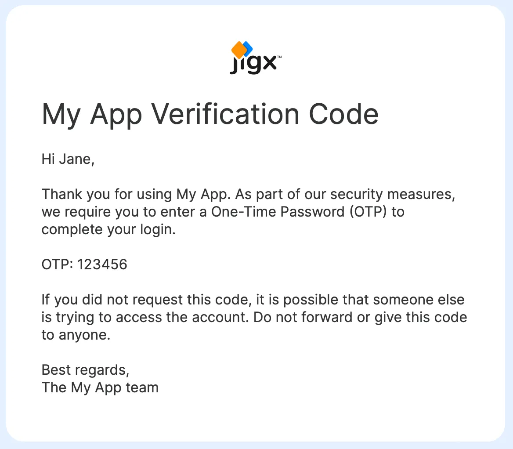

# Creating an account

To build and use Jigx solutions you require a Jigx account. You can create an account by registering on the [https://www.jigx.com/](https://www.jigx.com/) Jigx website or via an invitation from your organization. Follow the steps below to create an account.

## Register

Register at [manage.jigx.com/register](http://manage.jigx.com/register) to create an account.

### Sign up

1. Add your full name, surname, and work email address, and click the **signup** button.


Registering with a non-work email e.g. Gmail does not check for existing organizations or allow other people to find your organization during registration. To join or share your organization you need to invite people from Jigx Management.


<figure><figcaption>
Registration screen
</figcaption></figure>

### Verify your email

1. Enter the **Pin code** received in the email into the Pin screen.
2. Create a **password** following the Jigx password requirements (as displayed on the screen) and click **Continue**.

<figure><figcaption>
Registration Pin code
</figcaption></figure>

### Join or create an organization

1. Next any organizations linked to your email domain will be displayed and you can click the **Join** button or **Request to join** button next to your organization name.
2. Alternatively, you can choose to create a new organization by clicking the link, providing a name, and deciding who can see or join your organization based on the email domain.
3. Next Jigx Management opens on the **Quick Start** screen. Now you are ready to start building, using, and administering Jigx solutions.

<figure><figcaption>
Create an organization
</figcaption></figure>

## Invitation

Your organization's Jigx administrator sends an onboarding email invitation to your inbox. This invitation includes instructions on how to download your Jigx app.

<figure><figcaption>
Jigx invitation email
</figcaption></figure>

The Jigx app is available on your iOS and Android apps and works on any device.

* Download the Jigx iOS app from [App Store](https://apps.apple.com/sg/app/jigx/id1495596537)
* Download the Jigx Android app from [Google Play Store](https://play.google.com/store/apps/details?id=com.jigx.android\&pli=1)

### Getting started

Once you have downloaded the app, tap on the Jigx icon. Now tap the **Get Started** button and fill in your email address

<figure><figcaption>
Welcome and sign in
</figcaption></figure>

### 2-Step Verification

Once you tap the **Continue** button an email with your 6-digit long pin code is sent to your inbox.

<figure><figcaption>
Jigx app verification email
</figcaption></figure>

Enter the One-Time Password (OTP) received in the email into the 2-Step verification screen. After entering your OTP code the password setup screen opens. Create a password following the Jigx password requirements (as displayed on the screen).



<figure><figcaption>
2-Step verification screen
</figcaption></figure>



<figure><figcaption>
New Password screen
</figcaption></figure>



### Home Hub

Once your new password is set, the [Home Hub](../building-apps-with-jigx/ui/home-hub/home-hub.md) screen displays.

* When there are no solutions assigned to your account the home hub is empty. Assign solutions on the [Jigx Management](https://manage.jigx.com/) website
* If you have solutions assigned to your Jigx account, you will see the assigned solution on the Home Hub.
