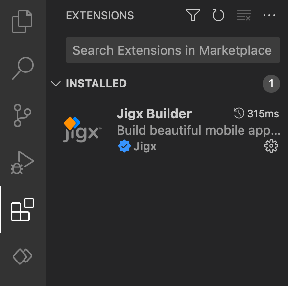

# Install the Jigx Builder

With Jigx, you build native mobile solutions in [Microsoft Visual Studio Code](https://code.visualstudio.com/), a development environment installed on many platforms, including Windows and Mac. Jigx extends VS Code with the Jigx Builder, an extension that allows you to build rapidly, test, and publish Jigx mobile apps.

## Installing Microsoft Visual Studio Code and the Jigx Builder extension

Start by downloading and installing VS Code on your development machine. The Jigx Builder extension is in the Microsoft [Visual Studio Marketplace](https://marketplace.visualstudio.com/items?itemName=Jigx.jigx-builder). Click on the VS Code extension icon in the left navigation bar and search for Jigx Builder. Go ahead and install it.


{% column width="41.66666666666667%" %}
The Jigx Builder now appears under your list of installed extensions and is automatically added to the side pane and is identifiable by its unique icon.


{% column width="58.33333333333333%" %}
<figure><figcaption>
Jigx Builder installed
</figcaption></figure>



Build Jigx projects by using the Jigx Builder extension and use YAML, SQL, JSON, and JSONata.

The Jigx Builder YAML editor includes code completion by simultaneously pressing the control and spacebar **(ctrl+space)** keys. Only valid options in the current cursor context display in the code popup.
