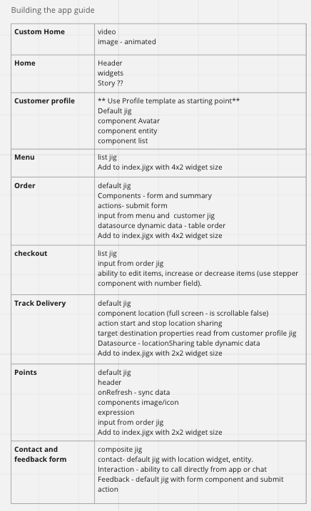
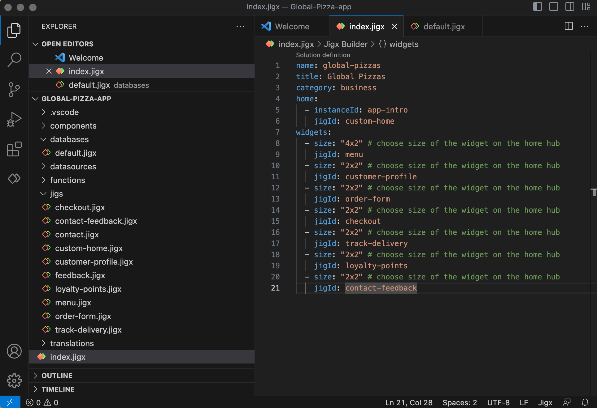

---
layout:
  width: wide
  title:
    visible: true
  description:
    visible: true
  tableOfContents:
    visible: true
  outline:
    visible: true
  pagination:
    visible: true
  metadata:
    visible: true
---

# Building the app

Now you are ready to start using your well-designed plan to build the app in Jigx Builder.

<figure><figcaption>
Build plan
</figcaption></figure>

### Steps

1. Start with the data. If you have a pre-existing datasource, create the functions, and stored procedures. If your data source is from scratch, start building the tables using [Dynamic Data](../../building-apps-with-jigx/data/data-providers/dynamic-data/creating-tables.md) or in [Microsoft Azure SQL](../../building-apps-with-jigx/data/data-providers/microsoft-azure-sql/microsoft-azure-sql.md). Refer to your data plan for details.
2. Next, build out the skeleton app based on must-have functionality, follow your solution design for each screen, and create the corresponding jig file. Choose components and UI elements that meet the requirements. See [examples](https://docs.jigx.com/examples) for a list of components, actions, widgets and jigs that can be used.
3. Now add visual improvements and nice-to-haves. e.g., on an email field, add the email icon to interact with sending an email.
4. Publish your app to the Jigx Cloud. Open the app on the mobile device and test each screen, data, and usability. Use [Jigx Dev Tools](../../building-apps-with-jigx/jigx-builder-code-editor/debugging.md) to debug the app, make changes and test again.
5. When the building of the app is complete, move on to the test plan.

<figure><figcaption>
App skeleton
</figcaption></figure>

### Considerations

* If you not sure what component, action or widget to use in your app build - get inspired by using [Templates](../../building-apps-with-jigx/ui/jigs-_screens_/jig-templates.md), the Jigx-sample, and the Jigx-widget projects in [GitHub](https://github.com/jigx-com/jigx-samples/tree/main/quickstart).
* When selecting the elements to add to the YAML, consider the usability, and shortest steps possible to get to where you want in the app.
* Minimize navigation, aim for smart navigation, 30-40 second engagement on screens, especially forms.
* Have the required input fields on the form with optional fields in another section.
* Jigx design methodology encourages 30-second success. This is important as mobile development is different from Web, and space is limited.

### Tips

* Create a prototype using [Templates](../../building-apps-with-jigx/ui/jigs-_screens_/jig-templates.md) to see if a component or jig will work in your build, from there, you can customize the template YAML snippet.
* Practice continuous testing by testing after building each screen.
