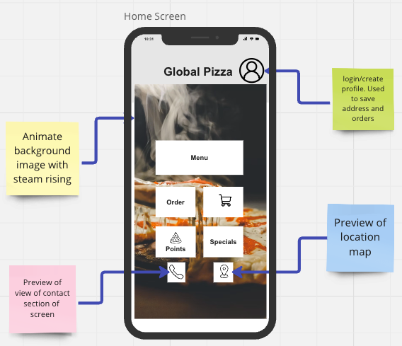

# Home screen

The home screen or [Home Hub](../../building-apps-with-jigx/ui/home-hub/home-hub.md) as it is called in Jigx is the entry point to your app and, therefore, needs to show the most relevant and important information upfront. Determine what users will interact with, then deep navigate into other screens.

<figure><figcaption>
Plan the home hub
</figcaption></figure>

#### Considerations

* Do you want a Home Hub with just widgets only or a custom home screen?
* The Home Hubis the entry point to the app, making it appealing by adding interactive elements. You can use [video-player](https://docs.jigx.com/examples/readme/components/video-player) or [carousel](https://docs.jigx.com/examples/readme/components/carousel) for visual interaction that includes videos, announcements, news clips, and more.

#### Tips

* Use the _jigx-widget_ solution available in [Quick Start](<../../Administration/Quick Start.md>) as a starting point to determine what widgets you want to use on the Home Hub.
