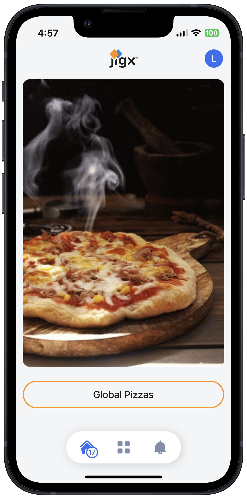

# Post App launch

Your Jigx App has successfully launched and is available in the App Store and Google Play store. This is not the end, a successful app solution has a plan for support and updates after the launch to ensure user satisfaction and app growth. Your app will require updates and new features that can be planned as part of a mobile application development lifecycle. Maintaining the app will continually be required by building new enhancements, fixing problems, and including updates to ensure its success.

<figure><figcaption></figcaption></figure>

In conclusion, by effectively planning a good app, you can engage users through a user-friendly UI that is consistent, secure, and provides a unique value offering to the user.
