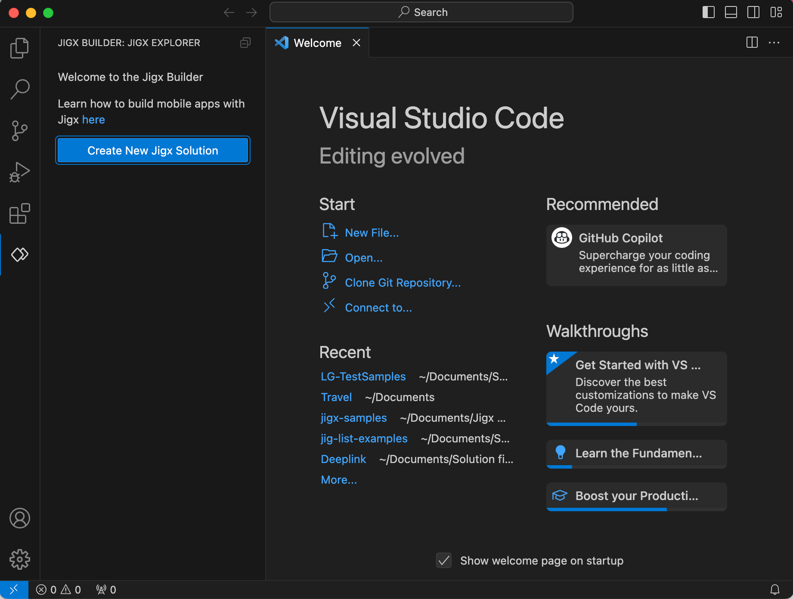
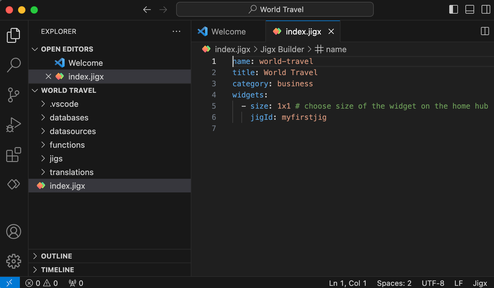
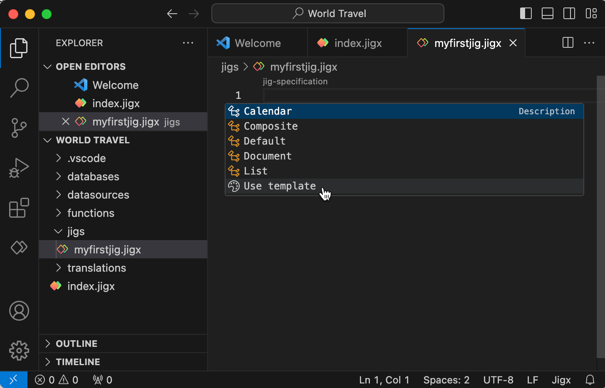
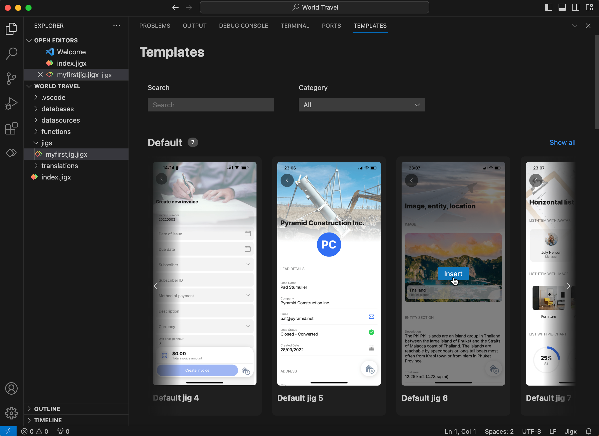
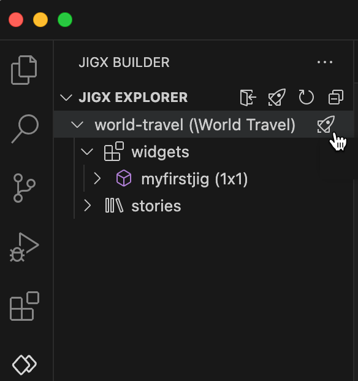

# Use templates to create apps

### What you will create

Create a travel app using one of the provided templates. The template inserts the required YAML in the correct format. Use the template as a base on which to build when creating a jig. If the template by default provides the functionality you need, publish your Jigx project to use the jig on your mobile device. \
**Build time:** 5 mins

<figure><figcaption></figcaption></figure>


Before you start building your first solution, ensure you have created a [Jigx's account](creating-an-account.md) and [Install the Jigx Builder](install-the-jigx-builder.md).&#x20;


#### Step 1: Create a new solution in Jigx Builder

1. Open VS Code, and click on the Jigx Builder **icon** in the left navigation bar. Select the **Create New Jigx Solution** button.
2. Type **World Travel** in the Solution title field and press enter. This name displays at the top of your solution on the Home Hub in the Jigx App.
3. The _Solution name_ field automatically pre-populates with the solution's system name world-travel. Press **Enter.**
4. For this solution select the **business** category.
5. Select a local folder where the project files are saved too. Your Jigx default solution files open in the VS Code editor with the .jigx extensions ready for editing.



<figure><figcaption></figcaption></figure>



<figure><figcaption></figcaption></figure>



#### Step 2: Choose a template

<figure><figcaption></figcaption></figure>

1. In Explorer expand the **jigs** folder and click on `myfirstjig.jigx` file. The Jigx auto-complete popup displays.
2. Click on **use template** to open the list of templates.
3. Under **Default** hover-over \*\*Default jig 6 \*\*and click the blue insert button.
4. The jigx file is populated with the YAML for the template.
5. Change the title to _**Thailand**_ as the `title` for your jig.
6. The `myfirstjig.jigx` file is already referenced in the `index.jigx` file which is the home screen file (Home Hub).



<figure><figcaption></figcaption></figure>



<figure><figcaption></figcaption></figure>



#### Step 3: Publish the solution




1. In VS Code click on the Jigx Builder **icon** in the left navigation bar.
2. In the Jigx Explorer hover over the **world-travel** node till you see the **publish** **icon (rocket)**. Click on the icon to start the publishing process.
3. Enter your Jigx username and press **Enter**.
4. Enter your Jigx password and press **Enter**. The publishing process starts and the progress shows in the bottom right corner of the VS Code editor. A message displays when the solution is successfully published.&#x20;



<figure><figcaption>
Publish Jigx project
</figcaption></figure>



#### Step 4: Open the app on your mobile device



1. On your mobile device **tap** the Jigx app icon.
2. Sign into the app with your [Jigx account](creating-an-account.md) details.
3. The app opens the [Home Hub](../building-apps-with-jigx/ui/home-hub/home-hub.md) screen displaying the **World Travel** solution.
4. Tap on the icon to display the **Thailand** destination screen.&#x20;




<figure><figcaption></figcaption></figure>




Yes it is that simple to build apps in Jigx. Explore further by either editing the YAML in `myfirstjig.jigx`; or adding additional files under the jig folder, add another template, reference the file in `index.jigx` and publish the solution.&#x20;


### What's next?

Why not build your own app? See how to [plan your app](planning-your-app/planning-your-app.md), then learn how to [create an app from scratch](create-an-app-from-scratch/create-an-app-from-scratch.md) or explore the various available UI elements in Jigx by adding the **Jigx-samples** [prebuilt solution](use-pre-built-solutions.md) to your organization and viewing the solution in the Jigx App.
